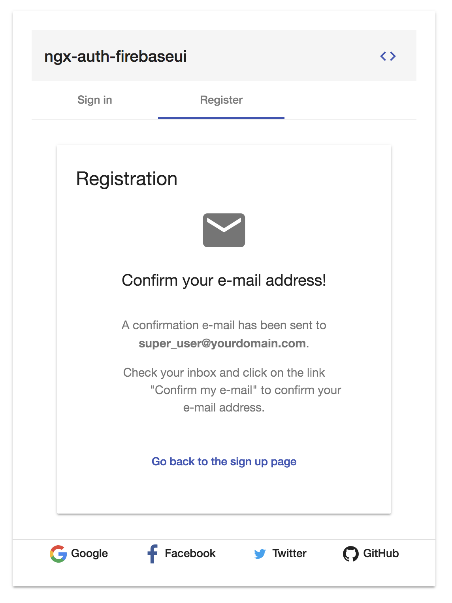
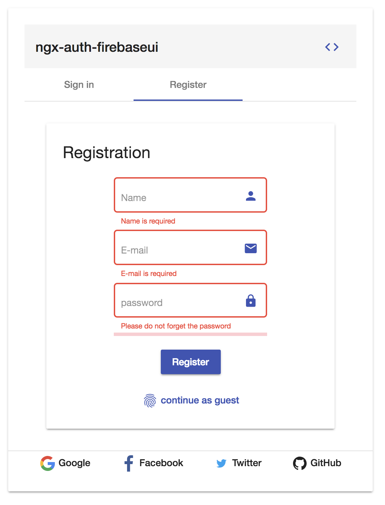
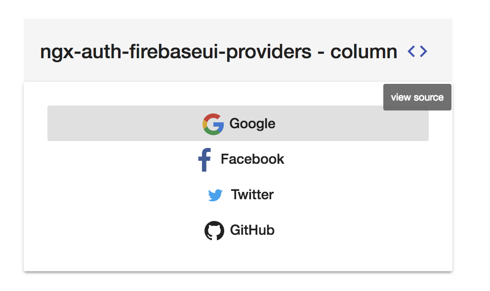
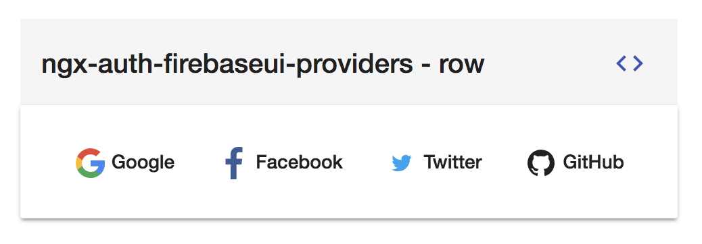
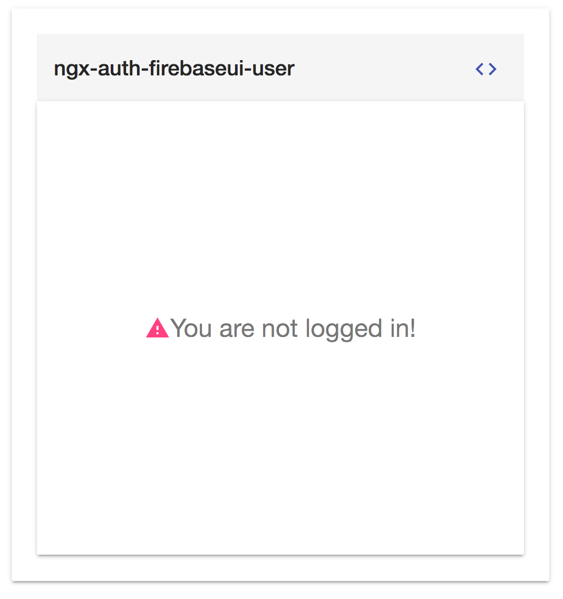
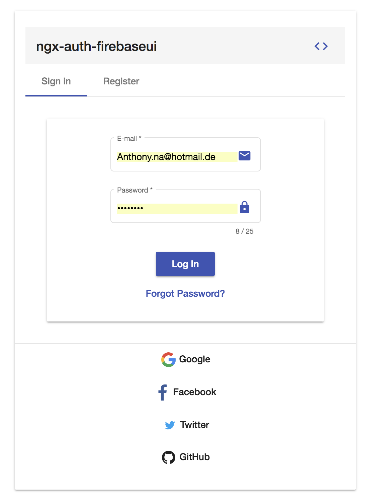
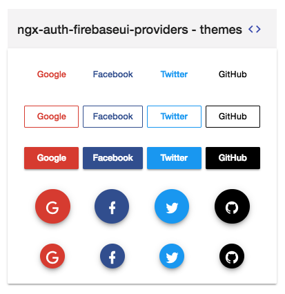

<p align="center">
  
</p>

# ngx-auth-firebaseui - Open Source Library for Angular Web Apps to integrate a material user interface for firebase authentication.

[](https://badge.fury.io/js/ngx-auth-firebaseui)
[](https://ngx-auth-firebaseui.firebaseapp.com)
[](https://ngx-auth-firebaseui.firebaseapp.com/doc/index.html)
[](https://codecov.io/gh/anthonynahas/ngx-auth-firebaseui)
[](https://circleci.com/gh/AnthonyNahas/ngx-auth-firebaseui)
[](https://travis-ci.org/AnthonyNahas/ngx-auth-firebaseui)
[](https://gitter.im/ngx-auth-firebaseui/Lobby?utm_source=badge&utm_medium=badge&utm_campaign=pr-badge&utm_content=badge)
[](https://david-dm.org/anthonynahas/ngx-auth-firebaseui)
[](https://david-dm.org/anthonynahas/ngx-auth-firebaseui#info=devDependencies)
[](https://www.npmjs.com/package/ngx-auth-firebaseui)
[](https://greenkeeper.io/)
[](https://github.com/AnthonyNahas/ngx-auth-firebaseui/blob/master/LICENSE)
[](https://github.com/AnthonyNahas/ngx-auth-firebaseui/fork)
[](https://github.com/AnthonyNahas/ngx-auth-firebaseui)
[](https://github.com/AnthonyNahas/ngx-auth-firebaseui)
[](https://twitter.com/ngAnthonyy)
[](https://twitter.com/ngAnthonyy)
[](https://github.com/gdi2290/awesome-angular)

<p align="center">
  
</p>

Angular UI component for [firebase](https://firebase.google.com/docs/auth/web/firebaseui) authentication.
This library is an angular module (including angular components and services) that allows to authenticate
your users with your firebase project. NgxAuthFirebseUI is compatible with
[angular material](https://material.angular.io/) and [angular flexLayout](https://github.com/angular/flex-layout).

** Angular Schematics is supported starting with v2.5.0 **

If you prefer to develop with bootstrap rather than with material design, please check this project [@firebaseui/ng-bootstrap](https://github.com/firebaseui/ng-bootstrap)

## Migration from V1 to V2
Since the first stable release of `angularfire2` has been published within the angular 
organization, we replaced that module with `@angular/fire`

Before updating `ngx-auth-firebaseui` to V2, please make sure that `angularifre2` has been replaced with `@angular/fire`
--> 
```bash
npm un angularfire2 && npm i @angular/fire 
```

## Built by and for developers :heart:
Do you have any question or suggestion ? Please do not hesitate to contact us!
Alternatively, provide a PR | open an appropriate issue [here](https://github.com/anthonynahas/ngx-auth-firebaseui/issues)

If you like this project, support [ngx-auth-firebaseui](https://github.com/anthonynahas/ngx-auth-firebaseui) 
by starring :star: and sharing it :loudspeaker:

## Table of Contents
- [ngx-auth-firebaseui vs firebaseui-web](#vs)
- [Why to use ngx-auth-firebaseui ?](#why-to-use-ngx-auth-firebaseui)
- [Library's components](#components)
- [Supported Providers](#supported-procress-and-actions)
- [Supported Processes and Actions](#supported-procress-and-actions)
- [Requirements](#requirements)
- [Demo](#demo)
- [Screenshots](#screenshots)
- [Peer Dependencies](#peerDependencies)
- [Dependencies](#dependencies)
- [Installation](#installation)
- [Configuration](#configuration)
- [Usage](#usage)
- [API](#api)
- [Run Demo App Locally](#run-demo-app-locally)
- [Other Angular Libraries](#other-angular-libraries)
- [Support](#support)
- [License](#license)

<a name="vs"/>

## ngx-auth-firebaseui vs firebaseui-web

| Features                                       | ngx-auth-firebaseui       | firebaseui  |
| -----------------------------------------------|:-------------:|         :-------------------:  |
| Sign Up                                        | :heavy_check_mark:    |  :heavy_check_mark:    |
| Sign In                                        | :heavy_check_mark:    |  :heavy_check_mark:    |
| Sign In Anonymously                            | :heavy_check_mark:    |  :heavy_check_mark:    |
| Sign In with Google                            | :heavy_check_mark:    |  :heavy_check_mark:    |
| Sign In with Facebook                          | :heavy_check_mark:    |  :heavy_check_mark:    |
| Sign In with Twitter                           | :heavy_check_mark:    |  :heavy_check_mark:    |
| Sign In with Github                            | :heavy_check_mark:    |  :heavy_check_mark:    |
| Sign In with PhoneNumber                       | :x:                   |  :heavy_check_mark:    |
| Sign out                                       | :heavy_check_mark:    |  :x:                   |
| Sign in/up progress indicator                  | :heavy_check_mark:    |  :x:                   |
| Password Strength indicator                    | :heavy_check_mark:    |  :x:                   |
| Forgot/Reset Password                          | :heavy_check_mark:    |  :x:                   |
| Delete account                                 | :heavy_check_mark:    |  :x:                   |
| Login Authentication Guard                     | :heavy_check_mark:    |  :x:                   |
| User Profile                                   | :heavy_check_mark:    |  :x:                   |
| Check whether user's email is verified         | :heavy_check_mark:    |  :x:                   |
| Edit user's display name (incl. validation)    | :heavy_check_mark:    |  :x:                   |
| Edit user's email (incl. validation)           | :heavy_check_mark:    |  :x:                   |
| Edit user's phone number (incl. validation)    | :heavy_check_mark:    |  :x:                   |
| Configure your favorite auth provider in runtime| :heavy_check_mark:   |  :x:                   |
| Sync user'auth with Firestore  [read more](FIRESTORE_SYNC.md)   | :heavy_check_mark:    |  :x:  |
| Angular v2-7 friendly                          | :heavy_check_mark:    |  :x:                   |
| Internationalization (i18n)                    | :soon:                |  :heavy_check_mark:    |
| Ionic/cordova support                          | :soon:  @firebaseui/ionic-auth |  :x: |
| Real time form validation                      | :heavy_check_mark:    |  :x:                   |
| Easy to integrate                              | :heavy_check_mark:    |  :x:                   |
| Support Server Side Rendering                  | :heavy_check_mark:    |  :x:                   |
| Support SPA without further config             | :heavy_check_mark:    |  :x:                   |
| Support Safari private browsing                | :heavy_check_mark:    |  :interrobang:         |
| AWESOME                                        | :heavy_check_mark:    |  :interrobang:         |


<a name="why-to-use-ngx-auth-firebaseui"/>

## Why to use ngx-auth-firebaseui ?
- :gift_heart: it uses a responsive and accessible web design UX/UI from google material concepts and components (supporting desktop and mobile view).
- :lipstick: pick up your own theme! change the primary, accent and warn colors whenever you need (e.g to support light and dark themes)
- :ship: super easy to use with an angular based project (project that is created with the [angular-cli](https://cli.angular.io/))
- :soon: optional configuration
- :recycle: configure your authentication providers in runtime
- :recycle: reusable components for every project that needs an authentication with a firebase project/app.
- :customs: built in feedback mechanism in form of a [snackbar](https://material.angular.io/components/snack-bar/overview) when an error or any important event occurred.
- :sos: ability to sign out or even to delete totally the account
- :ghost: your client does not want to create an account in your project? Let him to sign in anonymously!
- :busts_in_silhouette: user profile component to display user's data using <ngx-auth-firebaseui-user></ngx-auth-firebaseui-user> via `ngx-auth-firebaseui-user`
- :zap: update user profile as feature
- :fire: [Sync user's authentication with FIRESTORE](FIRESTORE_SYNC.md) **AUTOMATICALLY**
- :muscle: Forgot Password feature! Go and let your users to recover their passwords easily 
- :tada: Supports SSR - Server Side Rendering


<a name="components"/>

## Library's components
- `<ngx-auth-firebaseui>` used for the authentication process
- `<ngx-auth-firebaseui-providers>` used to display only buttons for providers like google, facebook, twitter and github
- `<ngx-auth-firebaseui-user>` used to display/edit the data of the current authenticated user

<a name="supported-providers"/>

## Supported Providers:
- anonymously
- email and password (traditional)
- google
- facebook
- twitter
- github
- phone number :soon:

<a name="supported-procress-and-actions"/>

## Supported Processes and Actions:
- sign up
- sign in
- sign in Anonymously | with google, facebook, twitter, github
- sign out
- validation of password's strength while creating a new account using [@angular-material-extensions/password-strength](https://github.com/AnthonyNahas/@angular-material-extensions/password-strength)
- forgot/reset password
- sending email verifications
- delete user's account
- edit user's profile like email, name, (profile picture :soon:) and phone number
- firestore auto sync :fire:  
- do not allow users to create new accounts before checking the terms of services and private policy - for mor info check this [here](https://ngx-auth-firebaseui.firebaseapp.com/examples/tos)

<a name="requirements"/>

### Requirements:
- [angular material theme](https://material.angular.io/guide/getting-started#step-4-include-a-theme)
- [angular material icons](https://material.angular.io/guide/getting-started#step-6-optional-add-material-icons)
- [angular cdk - v7.x](https://www.npmjs.com/package/@angular/cdk)
- [angular material - v7.x](https://www.npmjs.com/package/@angular/material)
- [angular forms - v7.x](https://www.npmjs.com/package/@angular/forms)
- [angular animations - v7.x](https://www.npmjs.com/package/@angular/animations)
- [angular flex-layout v7.0.0-beta.23](https://www.npmjs.com/package/@angular/flex-layout)
- [@angular/fire - v5.x](https://www.npmjs.com/package/@angular/fire)
- [firebase - v5.x](https://www.npmjs.com/package/firebase)

the full tutorial guide can be found [here](https://ngx-auth-firebaseui.firebaseapp.com/getting-started)


<a name="demo"/>

##  [Demo](https://ngx-auth-firebaseui.firebaseapp.com/) |  [Features](https://ngx-auth-firebaseui.firebaseapp.com/features) | [Examples](https://ngx-auth-firebaseui.firebaseapp.com/examples)

take a look at live example with firestore's synchronization [here](FIRESTORE_SYNC.md) 

---


<a name="sreenshots"/>

## Screenshots - Browser <ngx-auth-firebaseui></ngx-auth-firebaseui>
- sign in

<p align="center">
  
</p>

- Sign up - registration

#### before 

<p align="center">
  
</p>

#### after 
<p align="center">
  
</p>

#### demo outlook
<p align="center">
  
</p>

## Screenshots - Client Side Validation <ngx-auth-firebaseui></ngx-auth-firebaseui>
<p align="center">
  
</p>

## Screenshots  <ngx-auth-firebaseui-provider></ngx-auth-firebaseui-providers>

#### row layout
Please note: when the view port is getting too small, the layout will be 
automatically change to `column`
<p align="center">
  
</p>

#### column layout
<p align="center">
  
</p>

## Screenshots  <ngx-auth-firebaseui-user></ngx-auth-firebaseui-user>
- user profile

#### when logged out 
<p align="center">
  
</p>

#### when logged in
<p align="center">
  
</p>

#### in edit mode

<p align="center">
  
</p>

## Screenshots - Mobile Browser
- Sign in - mobile

<p align="center">
  
</p>

## Screenshots - Reset Password

- Before

<p align="center">
  
</p>

- After

<p align="center">
  
</p>

---

<a name="peerDependencies"/>

## Peer Dependencies - please make sure that peerDependencies are installed if you are not using the schematics

```json
"peerDependencies": {
    "@angular/core": "^7.x",
    "@angular/animations": "^7.x",
    "@angular/cdk": "^7.x",
    "@angular/flex-layout": "^7.0.0-beta.23",
    "@angular/forms": "^5.x",
    "@angular/material": "^5.x",
    "@angular/fire": "5.x",
    "firebase": "5.x",
  }
```

#### NOTE:
If you are still running angular v5, please consider to user `ngx-auth-firebaseui` v0.x

v1.x should be used with angular v7 projects

[help!](https://ngx-auth-firebaseui.firebaseapp.com/getting-started)


---

<a name="dependencies"/>

## Dependencies
* [Angular](https://angular.io) (*requires* Angular 2 or higher, developed with 7.x) - obviously
* [@angular-material-extensions/password-strength](https://www.npmjs.com/package/@angular-material-extensions/password-strength)

the [@angular-material-extensions/password-strength](https://www.npmjs.com/package/@angular-material-extensions/password-strength) is used
to indicate how secure is the provided password when registering a new firebase user e.g:

<p align="center">
  
</p>

<a name="installation"/>

## (1) [Installation](https://ngx-auth-firebaseui.firebaseapp.com/getting-started)

## 1. Install via *ng add*. (Recommended)

If Angular Material Design is not setup, just run `ng add @angular/material` [learn more](https://material.angular.io/guide/getting-started)

Now add the library via the `angular schematics`
```shell
ng add ngx-auth-firebaseui
```

- peer dependencies will be automatically added the package.json and installed
- `ngx-auth-firebaseui` 's module will be automatically imported to the root module (just replace `PUT_YOUR_FIREBASE_API_KEY_HERE` with your firebase api key)
- `ngx-auth-firebaseui` 's assets will be automatically added the `angular.json` file

## 2. Install via *npm*. (Alternative) 

Install above dependencies via *npm*.

Now install `ngx-auth-firebaseui` via:
```shell
npm install --save ngx-auth-firebaseui
```

```bash
npm i -s @angular/material @angular/cdk @angular/flex-layout @angular/forms @angular/animations
```

Firebase deps
```bash
npm i -s firebase @angular/fire
```

` -> continue by following the instructions ` [here](https://github.com/anthonynahas/ngx-auth-firebaseui/tree/master/docs/INSTRUCTIONS.md) 

Once installed you need to import the main module:
```js
import { NgxAuthFirebaseUIModule } from 'ngx-auth-firebaseui';
```
The only remaining part is to list the imported module in your application module. The exact method will be slightly
different for the root (top-level) module for which you should end up with the code similar to (notice ` NgxAuthFirebaseUIModule .forRoot()`):


and then from your Angular `AppModule`:

```typescript
import { BrowserModule } from '@angular/platform-browser';
import { NgModule } from '@angular/core';

import { AppComponent } from './app.component';

// Import your library
import { NgxAuthFirebaseUIModule } from 'ngx-auth-firebaseui';
import {BrowserAnimationsModule} from '@angular/platform-browser/animations';

@NgModule({
  declarations: [
    AppComponent
  ],
  imports: [
    BrowserModule,
    BrowserAnimationsModule,

    // Specify the ngx-auth-firebaseui library as an import
    NgxAuthFirebaseUIModule.forRoot({
                    apiKey: 'your-firebase-apiKey',
                    authDomain: 'your-firebase-authDomain',
                    databaseURL: 'your-firebase-databaseURL',
                    projectId: 'your-firebase-projectId',
                    storageBucket: 'your-firebase-storageBucket',
                    messagingSenderId: 'your-firebase-messagingSenderId'
                }),
  ],
  providers: [],
  bootstrap: [AppComponent]
})
export class AppModule { }

```

Other modules in your application can simply import ` NgxAuthFirebaseUIModule `:

```js
import { NgxAuthFirebaseUIModule } from 'ngx-auth-firebaseui';

@NgModule({
  declarations: [OtherComponent, ...],
  imports: [NgxAuthFirebaseUIModule, ...],
})
export class OtherModule {
}
```

---
##### SystemJS
>**Note**:If you are using `SystemJS`, you should adjust your configuration to point to the UMD bundle.
In your systemjs config file, `map` needs to tell the System loader where to look for `ngx-auth-firebaseui`:
```js
map: {
  'ngx-auth-firebaseui': 'node_modules/ngx-auth-firebaseui/bundles/ngx-auth-firebaseui.umd.js',
}
```

<a name="configuration"/>

## (2) [Configuration](https://ngx-auth-firebaseui.firebaseapp.com/examples)

```typescript
import { BrowserModule } from '@angular/platform-browser';
import { NgModule } from '@angular/core';

import { AppComponent } from './app.component';

// Import your library
import { NgxAuthFirebaseUIModule } from 'ngx-auth-firebaseui';
import {BrowserAnimationsModule} from '@angular/platform-browser/animations';

@NgModule({
  declarations: [
    AppComponent
  ],
  imports: [
    BrowserModule,
    BrowserAnimationsModule,

    // Specify the ngx-auth-firebaseui library as an import
    NgxAuthFirebaseUIModule.forRoot(
                {
                  apiKey: 'your-firebase-apiKey',
                  authDomain: 'your-firebase-authDomain',
                  databaseURL: 'your-firebase-databaseURL',
                  projectId: 'your-firebase-projectId',
                  storageBucket: 'your-firebase-storageBucket',
                  messagingSenderId: 'your-firebase-messagingSenderId'
                },
                 () => 'your_app_name_factory',
                {
                  enableFirestoreSync: true, // enable/disable autosync users with firestore
                  toastMessageOnAuthSuccess: false, // whether to open/show a snackbar message on auth success - default : true
                  toastMessageOnAuthError: false // whether to open/show a snackbar message on auth error - default : true
                }),
  ],
  providers: [],
  bootstrap: [AppComponent]
})
export class AppModule { }

```

----


<a name="usage"/>

---
## (3) [Usage](https://ngx-auth-firebaseui.firebaseapp.com/getting-started)

Once the library is imported, you can use its components, directives and pipes in your Angular application:

### `<ngx-auth-firebaseui></ngx-auth-firebaseui>`

```html
<!-- You can now use the library component in app.component.html  -->

<ngx-auth-firebaseui (onSuccess)="printUser($event)"
                     (onError)="printError()">
</ngx-auth-firebaseui>
```
or
```typescript
<!-- or simply in the app.component.ts -->
@Component({
    selector: 'app',
    template: `
        <ngx-auth-firebaseui (onSuccess)="printUser($event)" (onError)="printError()"></ngx-auth-firebaseui>`
})
class AppComponent {

    printUser(event) {
        console.log(event);
    }

    printError(event) {
        console.error(event);
    }
}
```

#### Result:

<p align="center">
  
</p>

### `<ngx-auth-firebaseui-providers></ngx-auth-firebaseui-providers>`
```html
<!-- You can now use the library component in app.component.html  -->
<ngx-auth-firebaseui-providers layout="column"></ngx-auth-firebaseui-providers>
```

### `<ngx-auth-firebaseui-user></ngx-auth-firebaseui-user>`

```html
<ngx-auth-firebaseui-user></ngx-auth-firebaseui-user>
```

#### Result:

<p align="center">
  
</p>

<a name="api"/>

## API

###  `<ngx-auth-firebaseui></ngx-auth-firebaseui>`

| option | bind  |  type  |   default    | description  |
|:---------------------|:------:|:------:|:------------:|:-------------------------------------------------------------------------------------------------|
| providers            | Input()  | string[] | ['all'] or [AuthProvider.All] | choose your favorite authentication provider: google | facebook | twitter | github
| appearance           | Input()  | MatFormFieldAppearance | `standard` | the appearance of the mat-form-field #'legacy' | 'standard' | 'fill' | 'outline' 
| tabIndex             | Input()  | number  | null; | `0` | the selected tab - either sign in or register
| registrationEnabled  | Input()  | boolean | `true` | whether the user is able to register a new account
| resetPasswordEnabled | Input()  | boolean | `true` | whether the user is able to reset his account password
| guestEnabled         | Input()  | boolean | `true` | whether the user can sign in and continue as guest
| tosUrl               | Input()  | string  | - | the url of term of services
| privacyPolicyUrl     | Input()  | string  | - | the url of the private privacy
| goBackURL            | Input()  | string  | - | the url to redirect to after creating a new user and clicking the `go back` button - the button is only available when the input is provided 
| messageOnAuthSuccess | Input()  | string  | see the code -> | the message of the snackbar when the authentication process was successful
| messageOnAuthError   | Input()  | string  | see the code -> | the message of the snackbar when the authentication process has failed
| onSuccess            | Output() | any     | - | this will be fired when an authentication process was success. The authenticated user is emitted!
| onError              | Output() | any     | - | this event will be fired when an error occurred during the authentication process! An error message is emitted!


PS: if either `tosUrl or `privacyPolicyUrl` are provided, the user will be asked to check and accepts tos and pp before registering a new account or sign in in anonymously

### How to disable users to sign in and continue as guest, use the `guestEnabled` input

```html
<ngx-auth-firebaseui [guestEnabled]="false"
                     (onSuccess)="printUser($event)"
                     (onError)="printError($event)">
</ngx-auth-firebaseui>
```

Result:

<p align="center">
  
</p>

### How to configure your input providers ? [see the examples](https://ngx-auth-firebaseui.firebaseapp.com/examples)
e.g:
in your component, import the AuthProvider enum to pick up your favorite provider:

```typescript
import {OnInit} from '@angular/core';
import {AuthProvider} from 'ngx-auth-firebaseui';

export class ExampleComponent implements OnInit {

  providers = AuthProvider;

  ngOnInit() {
  }
}
```

in your template -->
```html
  <ngx-auth-firebaseui
  [providers]="[providers.Google, providers.Facebook, providers.Twitter]"
  (onSuccess)="printUser($event)"
   (onError)="printError()"></ngx-auth-firebaseui>
```

or

```html
  <ngx-auth-firebaseui
  [providers]="['google', 'facebook', 'twitter']"
  (onSuccess)="printUser($event)"
  (onError)="printError()">
</ngx-auth-firebaseui>
```

take a look at the full documentation [here](https://ngx-auth-firebaseui.firebaseapp.com/doc/index.html)

### `<ngx-auth-firebaseui-providers></ngx-auth-firebaseui-providers>`

| option | bind  |  type  |   default    | description  |
|:---------------------|:------:|:------:|:------------:|:-------------------------------------------------------------------------------------------------|
| layout     | Input() | string     | `row` | set the layout of the providers buttons options: 'column' or 'row'
| theme      | Input() | string     | `default` | set the theme of the providers buttons options: '', 'classic', 'stroked', 'fab', 'mini-fab', 'raised',

e.g: in template:
```html
<ngx-auth-firebaseui-providers [theme]="themes.CLASSIC"></ngx-auth-firebaseui-providers>
<ngx-auth-firebaseui-providers [theme]="themes.STROKED"></ngx-auth-firebaseui-providers>
<ngx-auth-firebaseui-providers [theme]="themes.RAISED"></ngx-auth-firebaseui-providers>
<ngx-auth-firebaseui-providers [theme]="themes.FAB"></ngx-auth-firebaseui-providers>
<ngx-auth-firebaseui-providers [theme]="themes.MINI_FAB"></ngx-auth-firebaseui-providers>
```

in your component: 

```typescript
import {Component} from '@angular/core';
import {AuthProvider, Theme} from 'ngx-auth-firebaseui';

@Component({
selector: 'app-root',
templateUrl: './app.component.html',
styleUrls: ['./app.component.css']
})
export class AppComponent {

  themes = Theme;
}
```

<p align="center">
  
</p>

### `<ngx-auth-firebaseui-user></ngx-auth-firebaseui-user>`

| option | bind  |  type  |   default    | description  |
|:---------------------|:------:|:------:|:------------:|:-------------------------------------------------------------------------------------------------|
| editMode           | Input() | boolean     | false | whether the use is in edit mode
| canLogout          | Input() | boolean     | true | whether to render the logout button
| canDeleteAccount   | Input() | boolean     | true | whether to render the delete account button
| appearance         | Input() | MatFormFieldAppearance     | - | the style of the mat-input-form
| onAccountDeleted   | Output()| void     | - | this will be fired when the user deletes his account


### EXTRA TIP: Login Authentication Guard

If you want to prevent a route to be accessed from non authorized users, you can
use a built in `LoggedInGuard` angular router guard.

1. enter the fallback url in the `NgxAuthFirebaseUIConfig` under `authGuardFallbackURL`
2. import the `LoggedInGuard` in your router module

```ts
import {NgModule} from '@angular/core';
import {Routes, RouterModule} from '@angular/router';

import {LoggedInGuard} from 'ngx-auth-firebaseui';

const routes: Routes = [
  {
    path: '',
    redirectTo: 'home',
    pathMatch: 'full'
  },
  {
    path: 'secured',
    loadChildren: 'app/secured/secured.module#SecuredModule',
    canActivate: [LoggedInGuard]
  }
];

@NgModule({
  imports: [RouterModule.forRoot(routes)],
  exports: [RouterModule]
})
export class AppRoutingModule {
}

```

<a name="other-angular-libraries"/>

## Other Angular Libraries
- [@firebaseui/ng-bootstrap](https://github.com/firebaseui/ng-bootstrap)
- [ngx-linkifyjs](https://github.com/anthonynahas/ngx-linkifyjs)
- [@angular-material-extensions/password-strength](https://github.com/angular-material-extensions/password-strength)
- [@angular-material-extensions/link-preview](https://github.com/angular-material-extensions/link-preview)
- [@angular-material-extensions/pages](https://github.com/angular-material-extensions/pages)
- [@angular-material-extensions/contacts](https://github.com/angular-material-extensions/contacts)
- [@angular-material-extensions/faq](https://github.com/angular-material-extensions/faq)
- [@angular-material-extensions/jumbotron](https://github.com/angular-material-extensions/jumbotron)
- [@angular-material-extensions/google-maps-autocomplete](https://github.com/angular-material-extensions/google-maps-autocomplete)
- [@angular-material-extensions/combination-generator](https://github.com/angular-material-extensions/combination-generator)

---

<a name="support"/>

## Support
+ Drop an email to: [Anthony Nahas](mailto:anthony.na@hotmail.de)
+ or open an appropriate [issue](https://github.com/anthonynahas/ngx-auth-firebaseui/issues)
+ let us chat on [Gitter](https://gitter.im/ngx-auth-firebaseui/Lobby)
 
 Built by and for developers :heart: we will help you :punch:

---


This project is supported by [jetbrains](https://www.jetbrains.com/) with 1 ALL PRODUCTS PACK OS LICENSE incl. [webstorm](https://www.jetbrains.com/webstorm)

---

<a name="license"/>

## License

Copyright (c) 2018 [Anthony Nahas](https://github.com/AnthonyNahas). Licensed under the MIT License (MIT)
