<p align="center">
  
</p>

# ngx-auth-firebaseui - Open Source Library for Angular Web Apps to integrate a material user interface for firebase authentication.

[](https://badge.fury.io/js/ngx-auth-firebaseui)
[](https://ngx-auth-firebaseui.firebaseapp.com)
[](https://ngx-auth-firebaseui.firebaseapp.com/doc/index.html)
[](https://codecov.io/gh/anthonynahas/ngx-auth-firebaseui)
[](https://circleci.com/gh/AnthonyNahas/ngx-auth-firebaseui)
[](https://travis-ci.org/AnthonyNahas/ngx-auth-firebaseui)
[](https://gitter.im/ngx-auth-firebaseui/Lobby?utm_source=badge&utm_medium=badge&utm_campaign=pr-badge&utm_content=badge)
[](https://david-dm.org/anthonynahas/ngx-auth-firebaseui)
[](https://david-dm.org/anthonynahas/ngx-auth-firebaseui#info=devDependencies)
[](https://www.npmjs.com/package/ngx-auth-firebaseui)
[](https://greenkeeper.io/)
[](https://github.com/AnthonyNahas/ngx-auth-firebaseui/blob/master/LICENSE)
[](https://github.com/AnthonyNahas/ngx-auth-firebaseui/fork)
[](https://github.com/AnthonyNahas/ngx-auth-firebaseui)
[](https://github.com/AnthonyNahas/ngx-auth-firebaseui)
[](https://twitter.com/ngAnthonyy)
[](https://twitter.com/ngAnthonyy)
[](https://github.com/gdi2290/awesome-angular)


Angular UI component for [firebase](https://firebase.google.com/docs/auth/web/firebaseui) authentication.
This library is an angular module (including angular components and services) that allows to authenticate
your users with your firebase project. NgxAuthFirebseUI is compatible with
[angular material](https://material.angular.io/) and [angular flexLayout](https://github.com/angular/flex-layout).


If you prefer to develop with bootstrap rather than with material design, please check this project [@firebaseui/ng-bootstrap](https://github.com/firebaseui/ng-bootstrap)


## Built by and for developers :heart:
Do you have `any` question or suggestion ? Please do not hesitate to contact us!
Alternatively, provide a PR | open an appropriate issue [here](https://github.com/anthonynahas/ngx-auth-firebaseui/issues)

If you like this project, support [ngx-auth-firebaseui](https://github.com/anthonynahas/ngx-auth-firebaseui)
by starring :star: and sharing it :loudspeaker:

## Table of Contents
- [ngx-auth-firebaseui vs firebaseui-web](#vs)
- [Why to use ngx-auth-firebaseui ?](#why-to-use-ngx-auth-firebaseui)
- [Library's components](#components)
- [Supported Providers](#supported-providers)
- [Supported Processes and Actions](#supported-procress-and-actions)
- [Requirements](#requirements)
- [Demo](#demo)
- [Screenshots](#screenshots)
- [Peer Dependencies](#peerDependencies)
- [Dependencies](#dependencies)
- [Installation](#installation)
- [Configuration](#configuration)
- [Usage](#usage)
- [API](#api)
- [Run Demo App Locally](docs/INSTRUCTIONS_DEMO.md)
- [Other Angular Libraries](#other-angular-libraries)
- [Support](#support)
- [License](#license)

<a name="vs"/>

## ngx-auth-firebaseui vs firebaseui-web

| Features                                       | ngx-auth-firebaseui       | firebaseui  |
| -----------------------------------------------|:-------------:|         :-------------------:  |
| Sign Up                                        | :heavy_check_mark:    |  :heavy_check_mark:    |
| Sign In                                        | :heavy_check_mark:    |  :heavy_check_mark:    |
| Sign In Anonymously                            | :heavy_check_mark:    |  :heavy_check_mark:    |
| Sign In with Google                            | :heavy_check_mark:    |  :heavy_check_mark:    |
| Sign In with Apple                             | :heavy_check_mark:    |  :heavy_check_mark:    |
| Sign In with Facebook                          | :heavy_check_mark:    |  :heavy_check_mark:    |
| Sign In with Twitter                           | :heavy_check_mark:    |  :heavy_check_mark:    |
| Sign In with Github                            | :heavy_check_mark:    |  :heavy_check_mark:    |
| Sign In with Microsoft                         | :heavy_check_mark:    |  :heavy_check_mark:    |
| Sign In with Yahoo                             | :heavy_check_mark:    |  :heavy_check_mark:    |
| Sign In with Phone`number`                     | :x:                   |  :heavy_check_mark:    |
| Sign out                                       | :heavy_check_mark:    |  :x:                   |
| Sign in/up progress indicator                  | :heavy_check_mark:    |  :x:                   |
| Password Strength indicator                    | :heavy_check_mark:    |  :x:                   |
| Forgot/Reset Password                          | :heavy_check_mark:    |  :x:                   |
| [Password Strength Meter ](https://github.com/angular-material-extensions/password-strength)  | :heavy_check_mark:    |  :x:                   |
| Delete account                                 | :heavy_check_mark:    |  :x:                   |
| Login Authentication Guard                     | :heavy_check_mark:    |  :x:                   |
| User Profile                                   | :heavy_check_mark:    |  :x:                   |
| Check whether user's email is verified         | :heavy_check_mark:    |  :x:                   |
| Edit user's display name (incl. validation)    | :heavy_check_mark:    |  :x:                   |
| Edit user's email (incl. validation)           | :heavy_check_mark:    |  :x:                   |
| Edit user's phone `number` (incl. validation)    | :heavy_check_mark:    |  :x:                   |
| Configure your favorite auth provider in runtime| :heavy_check_mark:   |  :x:                   |
| Sync user'auth with Firestore  [read more](FIRESTORE_SYNC.md)   | :heavy_check_mark:    |  :x:  |
| Animations                                     | :heavy_check_mark:    |  :x:                   |
| Angular v2-8 friendly                          | :heavy_check_mark:    |  :x:                   |
| Internationalization (i18n)                    | :heavy_check_mark:    |  :heavy_check_mark:    |
| Ionic/cordova support                          | :soon:  @firebaseui/ionic-auth |  :x: |
| Real time form validation                      | :heavy_check_mark:    |  :x:                   |
| Easy to integrate                              | :heavy_check_mark:    |  :x:                   |
| Support Server Side Rendering                  | :heavy_check_mark:    |  :x:                   |
| Support SPA without further config             | :heavy_check_mark:    |  :x:                   |
| Support Safari private browsing                | :heavy_check_mark:    |  :interrobang:         |
| AWESOME                                        | :heavy_check_mark:    |  :interrobang:         |


<a name="why-to-use-ngx-auth-firebaseui"/>

## Why to use ngx-auth-firebaseui ?
- :gift_heart: it uses a responsive and accessible web design UX/UI from google material concepts and components (supporting desktop, tablet and mobile view) incl. smooth animations for a better UX.
- :lipstick: pick up your own theme! change the primary, accent and warn colors whenever you need (e.g to support light and dark themes)
- :ship: super easy to use with an angular based project (project that is created with the [angular-cli](https://cli.angular.io/))
- :soon: optional configuration
- :recycle: configure your authentication providers in runtime
- :recycle: reusable components for every project that needs an authentication with a firebase project/app.
- :customs: built in feedback mechanism in form of a [snackbar](https://material.angular.io/components/snack-bar/overview) when an error or `any` important event occurred.
- :sos: ability to sign out or even to delete totally the account
- :ghost: your client does not want to create an account in your project? Let him to sign in anonymously!
- :busts_in_silhouette: user profile component to display user's data using <ngx-auth-firebaseui-user></ngx-auth-firebaseui-user> via `ngx-auth-firebaseui-user`
- :zap: update user profile as feature
- :fire: [Sync user's authentication with FIRESTORE](FIRESTORE_SYNC.md) **AUTOMATICALLY**
- :muscle: Forgot Password feature! Go and let your users to recover their passwords easily
- :tada: Supports SSR - Server Side Rendering
- [support of i18n](https://ngx-auth-firebaseui.firebaseapp.com/i18n)


<a name="components"/>

## Library's components
- `<ngx-auth-firebaseui>` used for the authentication process [see more](docs/ngx-auth-firebaseui.md)
- `<ngx-auth-firebaseui-register>` standalone registration component to create new accounts [see more]()
- `<ngx-auth-firebaseui-login>` standalone login component to use already created accounts [see more]()
- `<ngx-auth-firebaseui-providers>` used to display only buttons for providers like google, facebook, twitter, github, microsoft and yahoo [see more]()
- `<ngx-auth-firebaseui-user>` used to display/edit the data of the current authenticated user in form of a material card [see more]()
- `<ngx-auth-firebaseui-avatar>` used to display/edit the data of the current authenticated user in the toolbar [see more]()

<a name="supported-providers"/>

## Supported Providers:
- anonymously
- email and password (traditional)
- google
- facebook
- twitter
- github
- Microsoft
- Yahoo
- phone `number` :soon:

<a name="supported-procress-and-actions"/>

## Supported Processes and Actions:
- sign up
- sign in
- sign in Anonymously | with google, facebook, twitter, github, microsoft, yahoo
- sign out
- validation of password's strength while creating a new account using [@angular-material-extensions/password-strength](https://github.com/AnthonyNahas/@angular-material-extensions/password-strength)
- forgot/reset password
- sending email verifications
- delete user's account
- edit user's profile like email, name, (profile picture :soon:) and phone `number`
- firestore auto sync :fire:
- do not allow users to create new accounts before checking the terms of services and private policy - for mor info check this [here](https://ngx-auth-firebaseui.firebaseapp.com/examples/tos)

## Supported Angular Guards
- `LoggedInGuard` used to protect angular routes from unauthenticated users (with fallback routes via `NgxAuthFirebaseUIConfig`)

<a name="requirements"/>

- [angular material theme](https://material.angular.io/guide/getting-started#step-4-include-a-theme)
- [angular material icons](https://material.angular.io/guide/getting-started#step-6-optional-add-material-icons)

- [angular cdk - v9.x](https://www.npmjs.com/package/@angular/cdk)
- [angular material - v9.x](https://www.npmjs.com/package/@angular/material)
- [angular forms - v9.x](https://www.npmjs.com/package/@angular/forms)
- [angular animations - v9.x](https://www.npmjs.com/package/@angular/animations)
- [angular router - v9.x](https://www.npmjs.com/package/@angular/router)
- [angular flex-layout v9.0.0-beta.29](https://www.npmjs.com/package/@angular/flex-layout)
- [@angular/fire - v5.4.x](https://www.npmjs.com/package/@angular/fire)
- [firebase - v7.x](https://www.npmjs.com/package/firebase)

the full tutorial guide can be found [here](https://ngx-auth-firebaseui.firebaseapp.com/getting-started)


<a name="demo"/>

##  [Demo](https://ngx-auth-firebaseui.firebaseapp.com/) |  [Features](https://ngx-auth-firebaseui.firebaseapp.com/features) | [Examples](https://ngx-auth-firebaseui.firebaseapp.com/examples)

take a look at live example with firestore's synchronization [here](FIRESTORE_SYNC.md)

---


<a name="sreenshots"/>

## Screenshots - Browser <ngx-auth-firebaseui></ngx-auth-firebaseui>
- sign in

v8

<p align="center">
  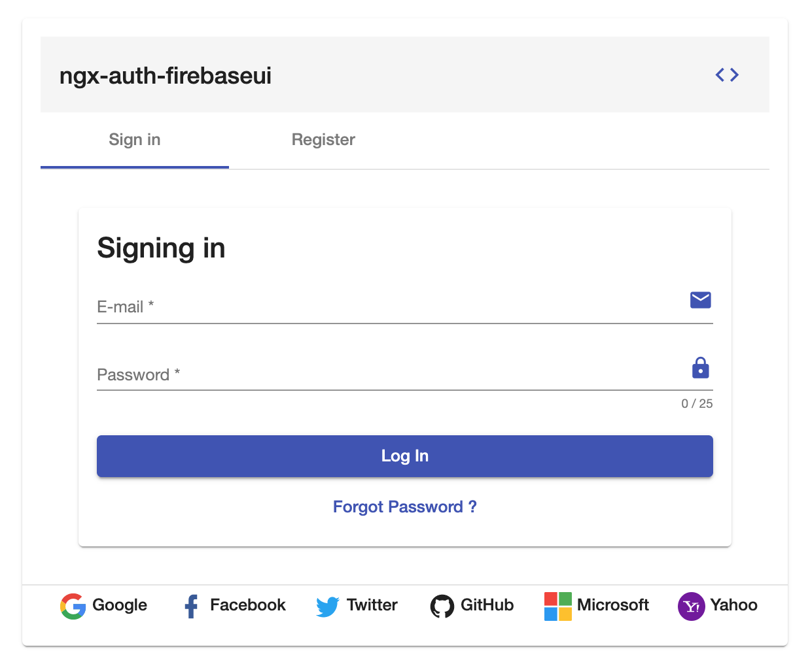
</p>

in combination with `ngx-auth-firebaseui-user`

<p align="center">
  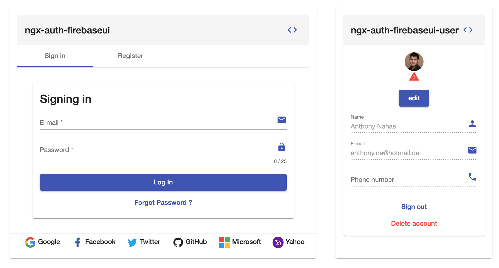
</p>

v7

<p align="center">
  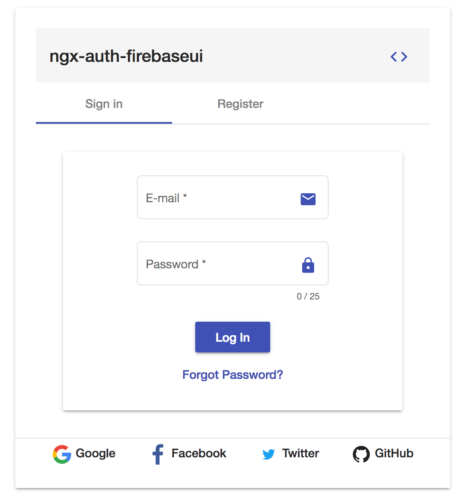
</p>

- Sign up - registration

#### before

<p align="center">
  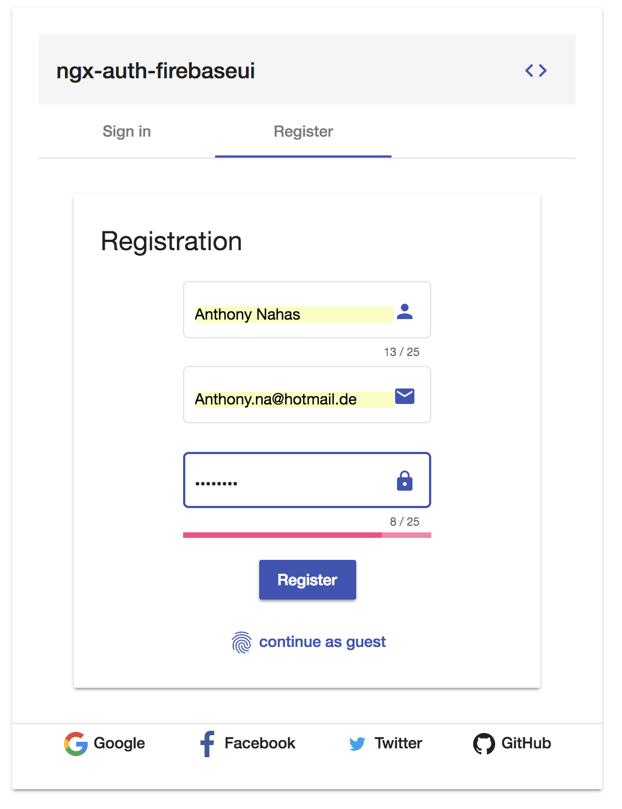
</p>

#### after
<p align="center">
  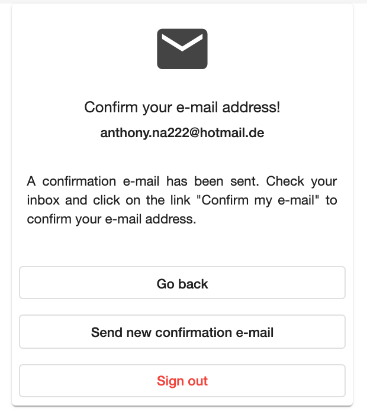
</p>

#### demo outlook
<p align="center">
  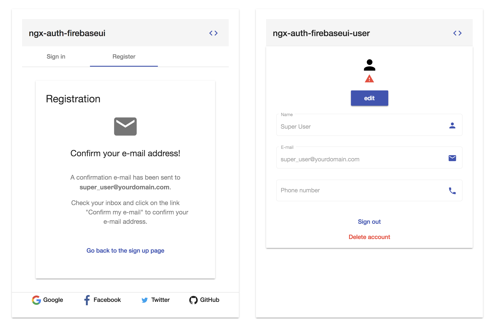
</p>


## Screenshots  <ngx-auth-firebaseui-provider></ngx-auth-firebaseui-providers>

#### row layout
Please note: when the view port is getting too small, the layout will be
automatically change to `column`
<p align="center">
  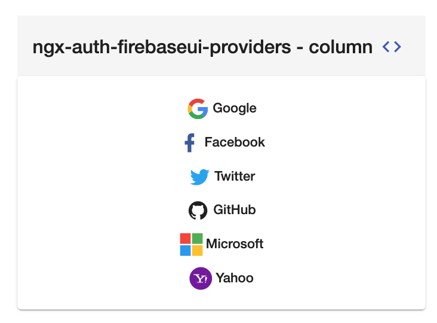
</p>


##  <ngx-auth-firebaseui-user></ngx-auth-firebaseui-user> | User Profile

#### when logged in
<p align="center">
  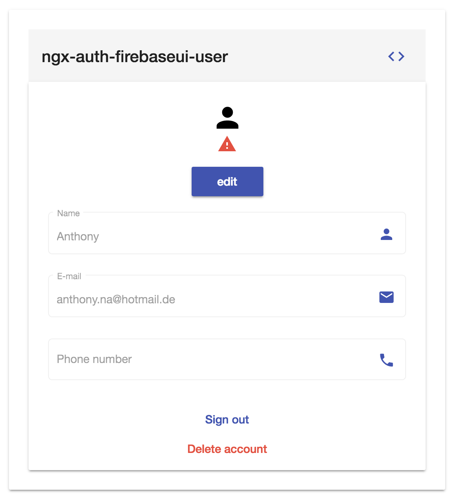
</p>

#### in edit mode

<p align="center">
  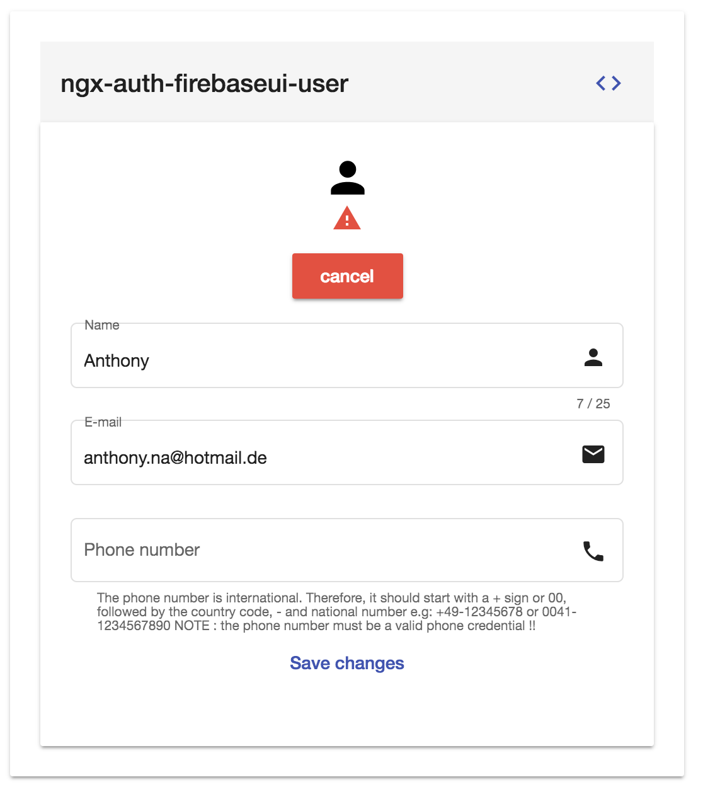
</p>


## Screenshots - Reset Password

- Before

<p align="center">
  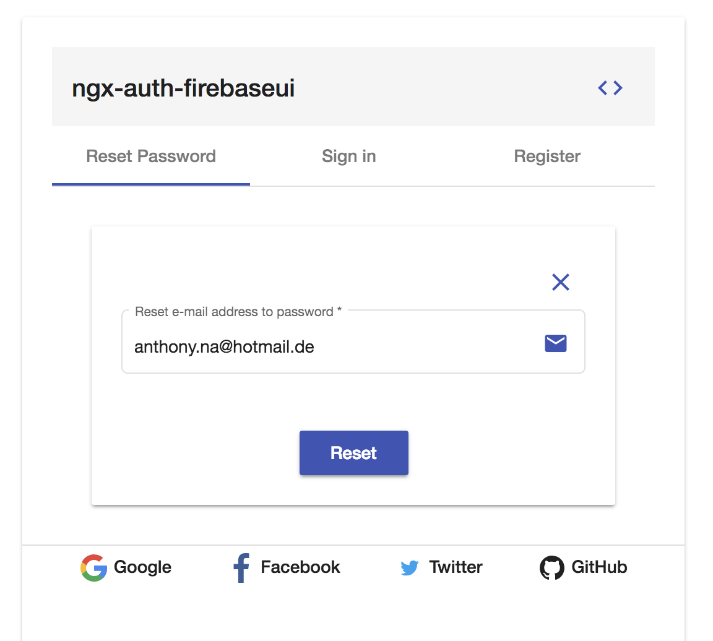
</p>

- After

<p align="center">
  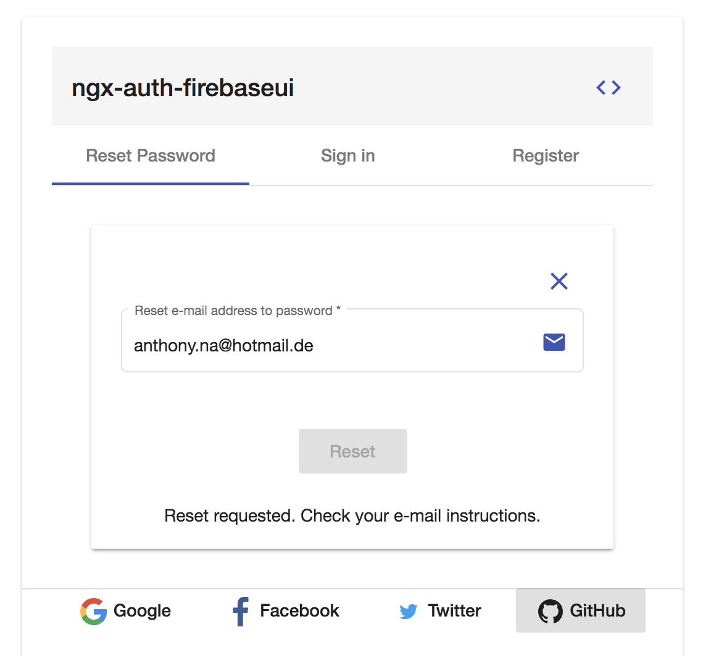
</p>


## Screenshot - [i18n - multiple languages](https://ngx-auth-firebaseui.firebaseapp.com/i18n)

<p align="center">
  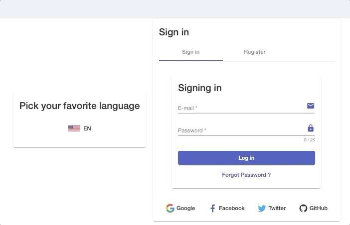
</p>

---

<a name="peerDependencies"/>

## Peer Dependencies - please make sure that peerDependencies are installed if you are not using the schematics

```json
"peerDependencies": {
    "@angular/core": "^9.x",
    "@angular/animations": "^9.x",
    "@angular/cdk": "^9.x",
    "@angular/flex-layout": "^9.0.0-beta.29",
    "@angular/forms": "^9.x",
    "@angular/material": "^9.x",
    "@angular/fire": "5.4.x",
    "firebase": "7.x",
  }
```

#### NOTE:

v1.x should be used with angular v7 projects
v3.x should be used with angular v8 projects
v4.x should be used with angular v9 projects

[help!](https://ngx-auth-firebaseui.firebaseapp.com/getting-started)


---

<a name="dependencies"/>

## Dependencies
* [Angular](https://angular.io) (*requires* Angular 2 or higher, developed with 9.x) - obviously
* [@angular-material-extensions/password-strength](https://www.npmjs.com/package/@angular-material-extensions/password-strength)

the [@angular-material-extensions/password-strength](https://www.npmjs.com/package/@angular-material-extensions/password-strength) is used
to indicate how secure is the provided password when registering a new firebase user e.g:

<p align="center">
  
</p>

<a name="installation"/>

## (1) [Installation](https://ngx-auth-firebaseui.firebaseapp.com/getting-started)

## 1. Install via *ng add*. (Recommended)

If Angular Material Design is not setup, just run `ng add @angular/material` [learn more](https://material.angular.io/guide/getting-started)

Now add the library via the `angular schematics`
```shell
ng add ngx-auth-firebaseui
```

- :heavy_check_mark: peer dependencies will be automatically added the package.json and installed
- :heavy_check_mark:  `ngx-auth-firebaseui` 's module will be automatically imported to the root module (just replace `PUT_YOUR_FIREBASE_API_KEY_HERE` with your firebase api key)
- :heavy_check_mark: `ngx-auth-firebaseui` 's assets will be automatically added the `angular.json` file

## 2. Install via *npm*. (Alternative)

Install above dependencies via *npm*.

Now install `ngx-auth-firebaseui` via:
```shell
npm install --save ngx-auth-firebaseui
```

```bash
npm i -s @angular/material @angular/cdk @angular/flex-layout @angular/forms @angular/animations @angular/router
```

Firebase deps
```bash
npm i -s firebase @angular/fire
```

` -> continue by following the instructions ` [here](https://github.com/anthonynahas/ngx-auth-firebaseui/tree/master/docs/INSTRUCTIONS.md)

Once installed you need to import the main module:
```js
import { NgxAuthFirebaseUIModule } from 'ngx-auth-firebaseui';
```
The only remaining part is to list the imported module in your application module. The exact method will be slightly
different for the root (top-level) module for which you should end up with the code similar to (notice ` NgxAuthFirebaseUIModule .forRoot()`):


and then from your Angular `AppModule`:

```typescript
import { BrowserModule } from '@angular/platform-browser';
import { NgModule } from '@angular/core';

import { AppComponent } from './app.component';

// Import your library
import { NgxAuthFirebaseUIModule } from 'ngx-auth-firebaseui';
import {BrowserAnimationsModule} from '@angular/platform-browser/animations';

@NgModule({
  declarations: [
    AppComponent
  ],
  imports: [
    BrowserModule,
    BrowserAnimationsModule,

    // Specify the ngx-auth-firebaseui library as an import
    NgxAuthFirebaseUIModule.forRoot({
                    apiKey: 'your-firebase-apiKey',
                    authDomain: 'your-firebase-authDomain',
                    databaseURL: 'your-firebase-databaseURL',
                    projectId: 'your-firebase-projectId',
                    storageBucket: 'your-firebase-storageBucket',
                    messagingSenderId: 'your-firebase-messagingSenderId'
                }),
  ],
  providers: [],
  bootstrap: [AppComponent]
})
export class AppModule { }

```

Other modules in your application can simply import ` NgxAuthFirebaseUIModule `:

```js
import { NgxAuthFirebaseUIModule } from 'ngx-auth-firebaseui';

@NgModule({
  declarations: [OtherComponent, ...],
  imports: [NgxAuthFirebaseUIModule, ...],
})
export class OtherModule {
}
```

---
##### SystemJS
>**Note**:If you are using `SystemJS`, you should adjust your configuration to point to the UMD bundle.
In your systemjs config file, `map` needs to tell the System loader where to look for `ngx-auth-firebaseui`:
```js
map: {
  'ngx-auth-firebaseui': 'node_modules/ngx-auth-firebaseui/bundles/ngx-auth-firebaseui.umd.js',
}
```

<a name="configuration"/>

## (2) [Configuration](https://ngx-auth-firebaseui.firebaseapp.com/examples)

```typescript
import { BrowserModule } from '@angular/platform-browser';
import { NgModule } from '@angular/core';

import { AppComponent } from './app.component';

// Import your library
import { NgxAuthFirebaseUIModule } from 'ngx-auth-firebaseui';
import {BrowserAnimationsModule} from '@angular/platform-browser/animations';

@NgModule({
  declarations: [
    AppComponent
  ],
  imports: [
    BrowserModule,
    BrowserAnimationsModule,

    // Specify the ngx-auth-firebaseui library as an import
    NgxAuthFirebaseUIModule.forRoot(
                {
                  apiKey: 'your-firebase-apiKey',
                  authDomain: 'your-firebase-authDomain',
                  databaseURL: 'your-firebase-databaseURL',
                  projectId: 'your-firebase-projectId',
                  storageBucket: 'your-firebase-storageBucket',
                  messagingSenderId: 'your-firebase-messagingSenderId'
                },
                 () => 'your_app_name_factory',
                {
                  enableFirestoreSync: true, // enable/disable autosync users with firestore
                  toastMessageOnAuthSuccess: false, // whether to open/show a snackbar message on auth success - default : true
                  toastMessageOnAuthError: false, // whether to open/show a snackbar message on auth error - default : true
                  authGuardFallbackURL: '/loggedout', // url for unauthenticated users - to use in combination with canActivate feature on a route
                  authGuardLoggedInURL: '/loggedin', // url for authenticated users - to use in combination with canActivate feature on a route
                  passwordMaxLength: 60, // `min/max` input parameters in components should be within this range.
                  passwordMinLength: 8, // Password length min/max in forms independently of each componenet min/max.
                  // Same as password but for the name
                  nameMaxLength: 50,
                  nameMinLength: 2,
                  // If set, sign-in/up form is not available until email has been verified.
                  // Plus protected routes are still protected even though user is connected.
                  guardProtectedRoutesUntilEmailIsVerified: true,
                  enableEmailVerification: true, // default: true
                }),
  ],
  providers: [],
  bootstrap: [AppComponent]
})
export class AppModule { }

```

----


<a name="usage"/>

---
## (3) [Usage](https://ngx-auth-firebaseui.firebaseapp.com/getting-started)

Once the library is imported, you can use its components, directives and pipes in your Angular application:

### `<ngx-auth-firebaseui></ngx-auth-firebaseui>` [see the usage](https://github.com/AnthonyNahas/ngx-auth-firebaseui/blob/master/docs/ngx-auth-firebaseui.md#usage)
### `<ngx-auth-firebaseui-login></ngx-auth-firebaseui-login>` [see the usage](https://github.com/AnthonyNahas/ngx-auth-firebaseui/blob/master/docs/ngx-auth-firebaseui-login.md#usage)
### `<ngx-auth-firebaseui-register></ngx-auth-firebaseui-register>` [see the usage](https://github.com/AnthonyNahas/ngx-auth-firebaseui/blob/master/docs/ngx-auth-firebaseui-register.md#usage)
### `<ngx-auth-firebaseui-providers></ngx-auth-firebaseui-providers>` [see the usage](https://github.com/AnthonyNahas/ngx-auth-firebaseui/blob/master/docs/ngx-auth-firebaseui-providers.md#usage)
### `<ngx-auth-firebaseui-user></ngx-auth-firebaseui-user>` [see the usage](https://github.com/AnthonyNahas/ngx-auth-firebaseui/blob/master/docs/ngx-auth-firebaseui-user.md#usage)
### `<ngx-auth-firebaseui-avatar></ngx-auth-firebaseui-avatar>` [see the usage](https://github.com/AnthonyNahas/ngx-auth-firebaseui/blob/master/docs/ngx-auth-firebaseui-avatar.md#usage)


<a name="api"/>

## API

### `<ngx-auth-firebaseui></ngx-auth-firebaseui>` [see the api](https://github.com/AnthonyNahas/ngx-auth-firebaseui/blob/master/docs/ngx-auth-firebaseui.md#api)
### `<ngx-auth-firebaseui-providers></ngx-auth-firebaseui-login>` [see the api](https://github.com/AnthonyNahas/ngx-auth-firebaseui/blob/master/docs/ngx-auth-firebaseui-login.md#api)
### `<ngx-auth-firebaseui-providers></ngx-auth-firebaseui-register>` [see the api](https://github.com/AnthonyNahas/ngx-auth-firebaseui/blob/master/docs/ngx-auth-firebaseui-register.md#api)
### `<ngx-auth-firebaseui-providers></ngx-auth-firebaseui-providers>` [see the api](https://github.com/AnthonyNahas/ngx-auth-firebaseui/blob/master/docs/ngx-auth-firebaseui-providers.md#api)
### `<ngx-auth-firebaseui-user></ngx-auth-firebaseui-user>` [see the api](https://github.com/AnthonyNahas/ngx-auth-firebaseui/blob/master/docs/ngx-auth-firebaseui-user.md#api)
### `<ngx-auth-firebaseui-user></ngx-auth-firebaseui-avatar>` [see the api](https://github.com/AnthonyNahas/ngx-auth-firebaseui/blob/master/docs/ngx-auth-firebaseui-avatar.md#api)


### EXTRA TIP: Login Authentication Guard

If you want to prevent a route to be accessed from non authorized users, you can
use a built in `LoggedInGuard` angular router guard.

1. enter the fallback url in the `NgxAuthFirebaseUIConfig` under `authGuardFallbackURL`
2. enter the logged in url in the `NgxAuthFirebaseUIConfig` under `authGuardLoggedInURL`

```ts
import {NgxAuthFirebaseUIModule} from 'ngx-auth-firebaseui';


NgxAuthFirebaseUIModule.forRoot(firebaseKey, firebaseAppNameFactory,
    {
      authGuardFallbackURL: 'examples/logged-out',
      authGuardLoggedInURL: 'examples/logged-in',
    }),
```

if the user is logged in, he will be redirected to `examples/logged-in` route (per example),
otherwise he will be redirected to the `examples/logged-out` route

3. import the `LoggedInGuard` in your router module

```ts
import {NgModule} from '@angular/core';
import {Routes, RouterModule} from '@angular/router';

import {LoggedInGuard} from 'ngx-auth-firebaseui';

const routes: Routes = [
  {
    path: '',
    redirectTo: 'home',
    pathMatch: 'full'
  },
  {
    path: 'secured',
    loadChildren: 'app/secured/secured.module#SecuredModule',
    canActivate: [LoggedInGuard]
  }
];

@NgModule({
  imports: [RouterModule.forRoot(routes)],
  exports: [RouterModule]
})
export class AppRoutingModule {
}

```

<a name="other-angular-libraries"/>

## Other Angular Libraries
- [@firebaseui/ng-bootstrap](https://github.com/firebaseui/ng-bootstrap)
- [ngx-linkifyjs](https://github.com/anthonynahas/ngx-linkifyjs)
- [@angular-material-extensions/components](https://github.com/angular-material-extensions/components)
- [@angular-material-extensions/password-strength](https://github.com/angular-material-extensions/password-strength)
- [@angular-material-extensions/google-maps-autocomplete](https://github.com/angular-material-extensions/google-maps-autocomplete)
- [@angular-material-extensions/fab-menu](https://github.com/angular-material-extensions/fab-menu)
- [@angular-material-extensions/select-country](https://github.com/angular-material-extensions/select-country)
- [@angular-material-extensions/pages](https://github.com/angular-material-extensions/pages)
- [@angular-material-extensions/link-preview](https://github.com/angular-material-extensions/link-preview)
- [@angular-material-extensions/contacts](https://github.com/angular-material-extensions/contacts)
- [@angular-material-extensions/faq](https://github.com/angular-material-extensions/faq)
- [@angular-material-extensions/jumbotron](https://github.com/angular-material-extensions/jumbotron)
- [angular-material-extensions/freelancer-theme](https://github.com/angular-material-extensions/freelancer-theme)

---

<a name="support"/>

## Support
+ Drop an email to: [Anthony Nahas](mailto:anthony.na@hotmail.de)
+ or open an appropriate [issue](https://github.com/anthonynahas/ngx-auth-firebaseui/issues)
+ let us chat on [Gitter](https://gitter.im/ngx-auth-firebaseui/Lobby)

 Built by and for developers :heart: we will help you :punch:

---


This project is supported by [jetbrains](https://www.jetbrains.com/) with 1 ALL PRODUCTS PACK OS LICENSE incl. [webstorm](https://www.jetbrains.com/webstorm)

---

<a name="license"/>

## License

Copyright (c) 2019-2020 [Anthony Nahas](https://github.com/AnthonyNahas). Licensed under the MIT License (MIT)
