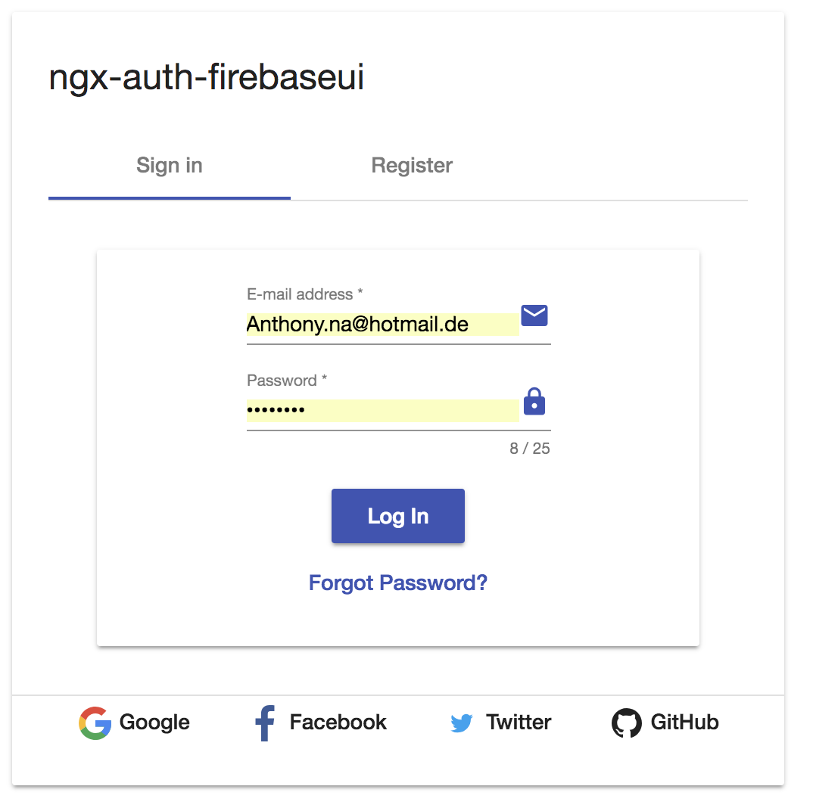
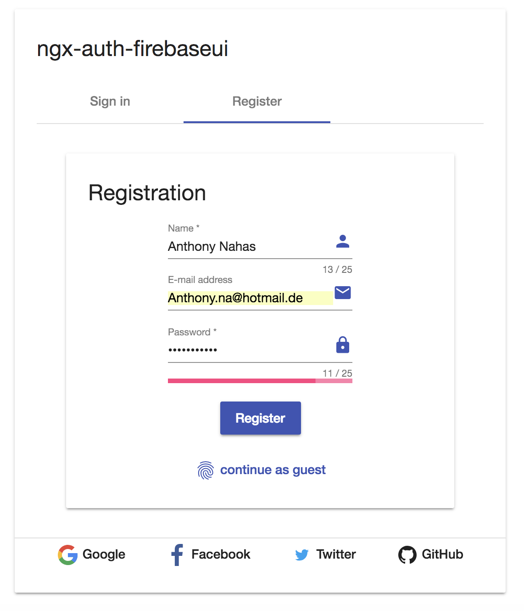
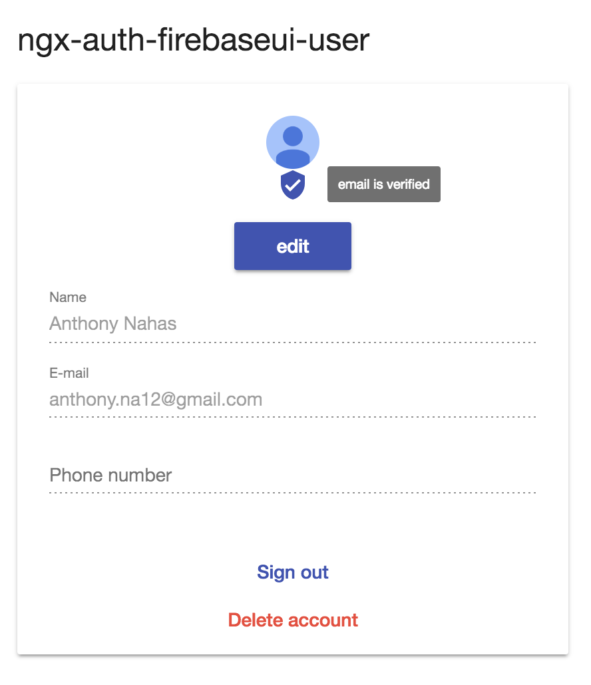
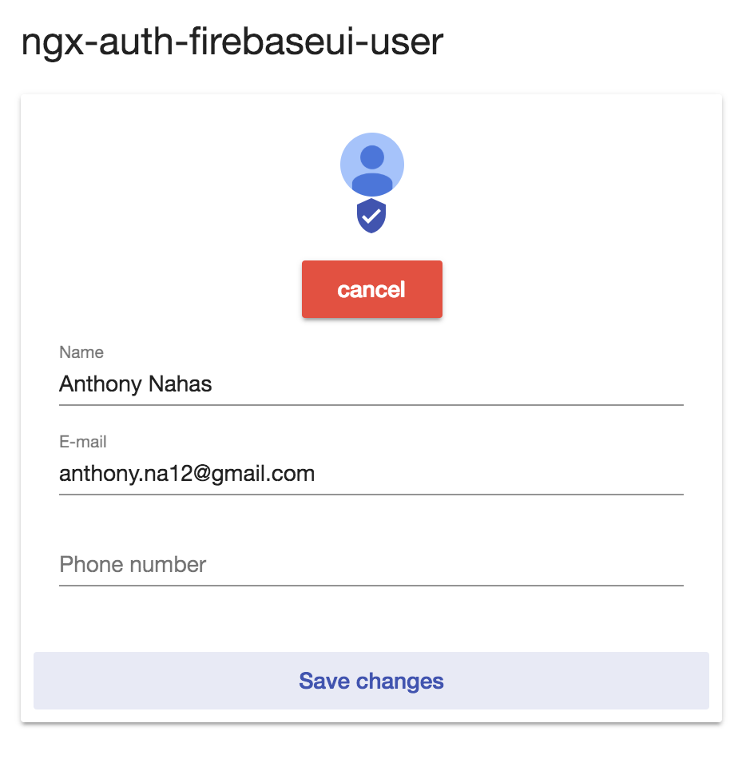
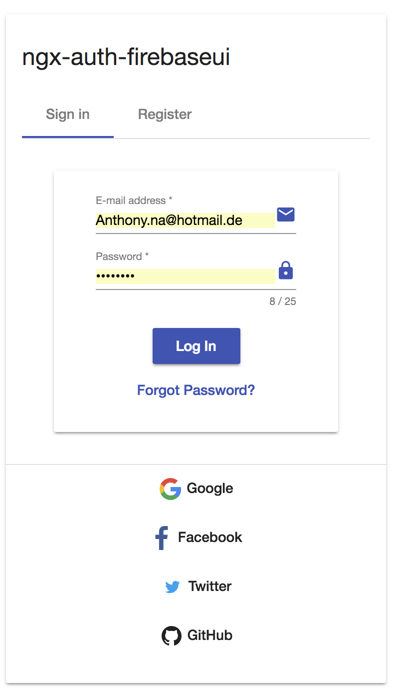
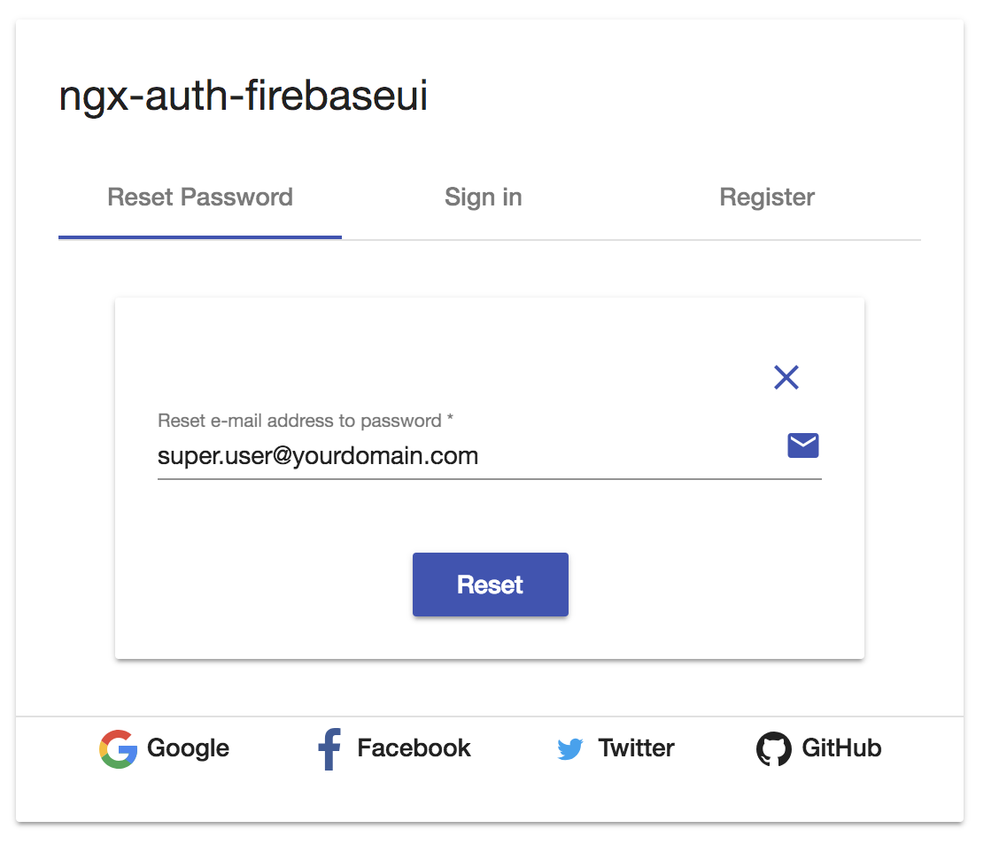
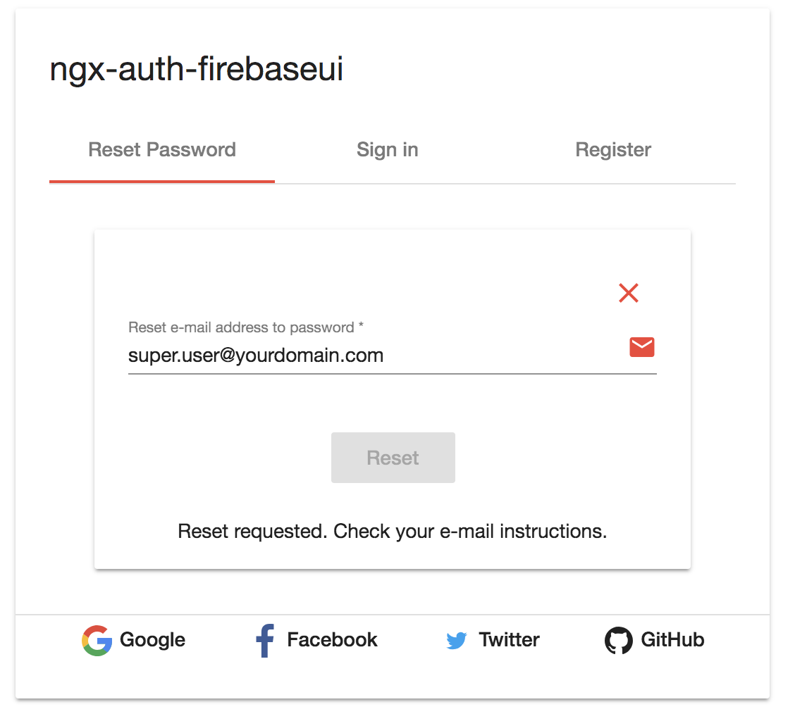
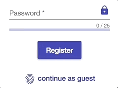

<p align="center">
  
</p>

# ngx-auth-firebaseui - Open Source Library for Angular Web Apps to integrate a material user interface for firebase authentication.

[](https://badge.fury.io/js/ngx-auth-firebaseui)
[](https://ngx-auth-firebaseui.firebaseapp.com)
[](https://circleci.com/gh/AnthonyNahas/ngx-auth-firebaseui)
[](https://gitter.im/ngx-auth-firebaseui/Lobby?utm_source=badge&utm_medium=badge&utm_campaign=pr-badge&utm_content=badge)
[](https://coveralls.io/github/anthonynahas/ngx-auth-firebaseui?branch=master)
[](https://david-dm.org/anthonynahas/ngx-auth-firebaseui)
[](https://david-dm.org/anthonynahas/ngx-auth-firebaseui#info=devDependencies)
[](https://www.npmjs.com/package/ngx-auth-firebaseui)
[](https://greenkeeper.io/)
[](https://ngx-auth-firebaseui.firebaseapp.com)
[](https://github.com/AnthonyNahas/ngx-auth-firebaseui/blob/master/LICENSE)
[](https://github.com/AnthonyNahas/ngx-auth-firebaseui/fork)
[](https://github.com/AnthonyNahas/ngx-auth-firebaseui)
[](https://github.com/AnthonyNahas/ngx-auth-firebaseui)
[](https://twitter.com/ngAnthonyy)
[](https://twitter.com/ngAnthonyy)

<p align="center">
  
</p>

Angular UI component for [firebase](https://firebase.google.com/docs/auth/web/firebaseui) authentication.
This library is an angular module (including angular components and services) that allows to authenticate
your users with your firebase project. NgxAuthFirebseUI is compatible with
[angular material](https://material.angular.io/) and [angular flexLayout](https://github.com/angular/flex-layout).
If you need me to support [bootstrap](https://getbootstrap.com/) please let me know and i will do it.

## Table of Contents
- [ngx-auth-firebaseui vs firebaseui-web](#vs)
- [Why to use ngx-auth-firebaseui ?](#why-to-use-ngx-auth-firebaseui)
- [Library's components](#components)
- [Supported Providers](#supported-procress-and-actions)
- [Supported Processes and Actions](#supported-procress-and-actions)
- [Requirements](#requirements)
- [Demo](#demo)
- [Features](#features)
- [Examples](#examples)
- [Documentation](#documentation)
- [Screenshots](#screenshots)
- [Peer Dependencies](#peerDependencies)
- [Dependencies](#dependencies)
- [Installation](#installation)
- [Usage](#usage)
- [API](#api)
- [Additional Requirements - material (Include a theme)](#additional-requirements-material-theme)
- [Additional Requirements - assets](#additional-requirements-assets)
- [Run Demo App Locally](#run-demo-app-locally)
- [Development](#development)
- [Other Angular Libraries](#other-angular-libraries)
- [Support](#support)
- [License](#license)

<a name="vs"/>

## ngx-auth-firebaseui vs firebaseui-web

| Features                                       | ngx-auth-firebaseui       | firebaseui  |
| -----------------------------------------------|:-------------:|         :-------------------:  |
| Sign Up                                        | :heavy_check_mark:    |  :heavy_check_mark:    |
| Sign In                                        | :heavy_check_mark:    |  :heavy_check_mark:    |
| Sign In Anonymously                            | :heavy_check_mark:    |  :x:                   |
| Sign In with Google                            | :heavy_check_mark:    |  :heavy_check_mark:    |
| Sign In with Facebook                          | :heavy_check_mark:    |  :heavy_check_mark:    |
| Sign In with Twitter                           | :heavy_check_mark:    |  :heavy_check_mark:    |
| Sign In with Github                            | :heavy_check_mark:    |  :heavy_check_mark:    |
| Sign In with PhoneNumber                       | :x:                   |  :heavy_check_mark:    |
| Sign out                                       | :heavy_check_mark:    |  :x:                   |
| Sign in/up progress indicator                  | :heavy_check_mark:    |  :x:                   |
| Password Strength indicator                    | :heavy_check_mark:    |  :x:                   |
| Forgot/Reset Password                          | :heavy_check_mark:    |  :x:                   |
| Delete account                                 | :heavy_check_mark:    |  :x:                   |
| User Profile                                   | :heavy_check_mark:    |  :x:                   |
| Check whether user's email is verified         | :heavy_check_mark:    |  :x:                   |
| Edit User (name, email)                        | :heavy_check_mark:    |  :x:                   |
| Configure your favorite auth provider in runtime| :heavy_check_mark:    |  :x:                   |
| Sync user'auth with Firestore                  | :heavy_check_mark:    |  :x:                   |
| Angular v2-5 friendly                          | :heavy_check_mark:    |  :x:                   |
| Real time form validation                      | :heavy_check_mark:    |  :x:                   |
| Easy to integrate                              | :heavy_check_mark:    |  :x:                   |
| Support Server Side Rendering                  | :heavy_check_mark:    |  :x:                   |
| Support SPA without further config             | :heavy_check_mark:    |  :x:                   |
| Support Safari private browsing                | :heavy_check_mark:    |  :x:                   |


<a name="why-to-use-ngx-auth-firebaseui"/>

## Why to use ngx-auth-firebaseui ?
- it uses a responsive and accessible web design UX/UI from google material concepts and components (supporting desktop and mobile view).
- pick up your own theme! change the primary, accent and warn colors whenever you need (e.g to support light and dark themes)
- super easy to use with an angular based project (project that is created with [angular-cli](https://cli.angular.io/))
- optional configuration
- configure your authentication providers in runtime
- reusable components for every project that needs an authentication with a firebase project/app.
- built in feedback mechanism in form of a [snackbar](https://material.angular.io/components/snack-bar/overview) when an error or any important event occurred.
- ability to sign out or even to delete totally the account
- your client does not want to create an account in your project? Let him to sign in anonymously!
- user profile component to display user's data using <ngx-auth-firebaseui-user></ngx-auth-firebaseui-user>
- update user profile as feature
- Sync user's authentication with FIRESTORE (documentation coming soon)
- Forgot Password as feature
- Supports SSR - Server Side Rendering


<a name="components"/>

## Library's components
- `<ngx-auth-firebaseui>` used for the authentication process
- `<ngx-auth-firebaseui-user>` used to display/edit the data of the current authenticated user

<a name="supported-providers"/>

## Supported Providers:
- anonymously
- email and password (traditional)
- google
- facebook
- twitter
- github
- phone number (todo)

<a name="supported-procress-and-actions"/>

## Supported Processes and Actions:
- sign up
- sign in
- sign in Anonymously | with google, facebook, twitter, github
- sign out
- validation of password's strength while creating a new account using [ngx-material-password-strength](https://github.com/AnthonyNahas/ngx-material-password-strength)
- forgot/reset password
- sending email verifications
- delete user's account
- edit user's profile like email, name, profile picture and phone number


<a name="requirements"/>

### Requirements:
- [angular cdk - v5.2.4 ](https://www.npmjs.com/package/@angular/cdk)
- [angular material - v5.2.4](https://www.npmjs.com/package/@angular/material)
- [angular material theme](https://material.angular.io/guide/getting-started#step-4-include-a-theme)
- [angular material icons](https://material.angular.io/guide/getting-started#step-6-optional-add-material-icons)
- [angular forms - v5.2.9](https://www.npmjs.com/package/@angular/forms)
- [angular animations - v5.2.9](https://www.npmjs.com/package/@angular/animations)
- [angular flex-layout v5.0.0-beta.14](https://www.npmjs.com/package/@angular/flex-layout)
- [angularfire2 - v5.0.0-rc.6.0](https://www.npmjs.com/package/angularfire2)
- [firebase - v4.12.1](https://www.npmjs.com/package/firebase)

the full tutorial guide can be found [here](https://ngx-auth-firebaseui.firebaseapp.com/getting-started)


<a name="demo"/>

##  [Demo](https://ngx-auth-firebaseui.firebaseapp.com/)

- Try it out
```js
if(issues || feedback || you_need_more_features){
    // send me an email -> to: anthony.na@hotmail.de
}
```

<a name="features"/>

## [Features](https://ngx-auth-firebaseui.firebaseapp.com/features)
here are some features, the rest is coming soon


---


<a name="examples"/>

## [Examples](https://ngx-auth-firebaseui.firebaseapp.com/examples)

---

<a name="documentation"/>

## [Documentation](https://ngx-auth-firebaseui.firebaseapp.com/doc/index.html)

<a name="sreenshots"/>

## Screenshots - Browser <ngx-auth-firebaseui></ngx-auth-firebaseui>
- sign in

<p align="center">
  
</p>

- Sign up - registration

<p align="center">
  
</p>

## Screenshots  <ngx-auth-firebaseui-user></ngx-auth-firebaseui-user>
- user profile

<p align="center">
  
</p>

- edit user

<p align="center">
  
</p>

## Screenshots - Mobile Browser
- Sign in - mobile

<p align="center">
  
</p>

## Screenshots - Reset Password

- Before

<p align="center">
  
</p>

- After

<p align="center">
  
</p>

---

<a name="peerDependencies"/>

## Peer Dependencies - please make sure that peerDependencies are installed

```json
"peerDependencies": {
    "@angular/core": "^5.x",
    "@angular/animations": "^5.x",
    "@angular/cdk": "^5.x",
    "@angular/flex-layout": "^5.0.0-beta.13",
    "@angular/forms": "^5.x",
    "@angular/material": "^5.x",
    "angularfire2": "5.0.0-rc.6.0",
    "firebase": "4.12.1",
    "rxjs": "^5.5.8",
    "zone.js": "^0.8.4"
  }
```

e.g:

Angular deps
```bash
npm i -s @angular/material@5.2.4 @angular/cdk@5.2.4 @angular/flex-layout@5.0.0-beta.14 @angular/forms@5.2.9 @angular/animations@5.2.9
```

Firebase deps
```bash
npm i -s firebase@4.13.1 angularfire2@5.0.0-rc.6.0
```

NB: the library is not compatible with the latest release of
 angularfire2 v5.0.0-rc.7 !!!! (there are some bugs found like zone alreay loaded... so waiting...)


[help!](https://ngx-auth-firebaseui.firebaseapp.com/getting-started)


---

<a name="dependencies"/>

## Dependencies
* [Angular](https://angular.io) (*requires* Angular 2 or higher, developed with 5.2.10)
* [ngx-material-password-strength](https://www.npmjs.com/package/ngx-material-password-strength)

the [ngx-material-password-strength](https://www.npmjs.com/package/ngx-material-password-strength) is used
to indicate how secure is the provided password when registering a new firebase user e.g:

<p align="center">
  
</p>

<a name="installation"/>

## (1) [Installation](https://ngx-auth-firebaseui.firebaseapp.com/getting-started)

Install above dependencies via *npm*.

Now install `ngx-auth-firebaseui` via:
```shell
npm install --save ngx-auth-firebaseui
```
Once installed you need to import the main module:
```js
import { NgxAuthFirebaseUIModule } from 'ngx-auth-firebaseui';
```
The only remaining part is to list the imported module in your application module. The exact method will be slightly
different for the root (top-level) module for which you should end up with the code similar to (notice ` NgxAuthFirebaseUIModule .forRoot()`):


and then from your Angular `AppModule`:

```js
import { BrowserModule } from '@angular/platform-browser';
import { NgModule } from '@angular/core';

import { AppComponent } from './app.component';

// Import your library
import { NgxAuthFirebaseUIModule } from 'ngx-auth-firebaseui';
import {BrowserAnimationsModule} from '@angular/platform-browser/animations';

@NgModule({
  declarations: [
    AppComponent
  ],
  imports: [
    BrowserModule,
    BrowserAnimationsModule,

    // Specify the ngx-auth-firebaseui library as an import
    NgxAuthFirebaseUIModule.forRoot({
                    apiKey: 'your-firebase-apiKey',
                    authDomain: 'your-firebase-authDomain',
                    databaseURL: 'your-firebase-databaseURL',
                    projectId: 'your-firebase-projectId',
                    storageBucket: 'your-firebase-storageBucket',
                    messagingSenderId: 'your-firebase-messagingSenderId'
                }),
  ],
  providers: [],
  bootstrap: [AppComponent]
})
export class AppModule { }

```

Other modules in your application can simply import ` NgxAuthFirebaseUIModule `:

```js
import { NgxAuthFirebaseUIModule } from 'ngx-auth-firebaseui';

@NgModule({
  declarations: [OtherComponent, ...],
  imports: [NgxAuthFirebaseUIModule, ...],
})
export class OtherModule {
}
```

---
##### SystemJS
>**Note**:If you are using `SystemJS`, you should adjust your configuration to point to the UMD bundle.
In your systemjs config file, `map` needs to tell the System loader where to look for `ngx-auth-firebaseui`:
```js
map: {
  'ngx-auth-firebaseui': 'node_modules/ngx-auth-firebaseui/bundles/ngx-auth-firebaseui.umd.js',
}
```

<a name="usage"/>

---
## (2) [Usage](https://ngx-auth-firebaseui.firebaseapp.com/getting-started)

Once the library is imported, you can use its components, directives and pipes in your Angular application:

### <ngx-auth-firebaseui></ngx-auth-firebaseui>

```html
<!-- You can now use the library component in app.component.html  -->

<ngx-auth-firebaseui (onSuccess)="printUser($event)"
                     (onError)="printError()">
</ngx-auth-firebaseui>
```
or
```ts
<!-- or simply in the app.component.ts -->
@Component({
    selector: 'app',
    template: `
        <ngx-auth-firebaseui (onSuccess)="printUser($event)" (onError)="printError()"></ngx-auth-firebaseui>`
})
class AppComponent {

    printUser(event) {
        console.log(event);
    }

    printError(event) {
        console.error(event);
    }
}
```

#### Result:

<p align="center">
  
</p>

### <ngx-auth-firebaseui-user></ngx-auth-firebaseui-user>

```html
<ngx-auth-firebaseui-user></ngx-auth-firebaseui-user>
```

#### Result:

<p align="center">
  
</p>

<a name="api"/>

## API

###  <ngx-auth-firebaseui></ngx-auth-firebaseui>

| option | bind  |  type  |   default    | description  |
|:---------------------|:------:|:------:|:------------:|:-------------------------------------------------------------------------------------------------|
| providers            | Input()  | string[] | ['all'] or [AuthProvider.All] | choose your favorite authentication provider: google | facebook | twitter | github
| onSuccess            | Output() | any     | - | this will be fired when an authentication process was success. The authenticated user is emitted!
| onError              | Output() | any     | - | this event will be fired when an error occurred during the authentication process! An error message is emitted!


### How to configure your input providers ? [see the examples](https://ngx-auth-firebaseui.firebaseapp.com/examples)
e.g:
in your component, import the AuthProvider enum to pick up your favorite provider:

```typescript
import {AuthProvider} from 'ngx-auth-firebaseui';

export class ExampleComponent implements OnInit {

  providers = AuthProvider;

  ngOnInit() {
    }


}
```

in your template -->
```html
  <ngx-auth-firebaseui
  [providers]="[providers.Google, providers.Facebook, providers.Twitter]"
  (onSuccess)="printUser($event)"
   (onError)="printError()"></ngx-auth-firebaseui>
```

or

```html
  <ngx-auth-firebaseui
  [providers]="['google', 'facebook', 'twitter']"
  (onSuccess)="printUser($event)"
   (onError)="printError()"></ngx-auth-firebaseui>
```

take a look at the full documentation [here](https://ngx-auth-firebaseui.firebaseapp.com/doc/index.html)


### <ngx-auth-firebaseui-user></ngx-auth-firebaseui-user>

| option | bind  |  type  |   default    | description  |
|:---------------------|:------:|:------:|:------------:|:-------------------------------------------------------------------------------------------------|
| onAccountDeleted     | Output() | void     | - | this will be fired when the user deletes his account


<a name="additional-requirements-material-theme"/>

## (3) Additional Requirements - material (Include a theme)
#### With Angular CLI
Please take a look of the official documentation of **angular material themes** [here](https://material.angular.io/guide/getting-started#step-4-include-a-theme)
#### Without Angular CLI

[see how it works](https://material.angular.io/guide/theming)

----

<a name="additional-requirements-assets"/>

## (4) Additional Requirements - assets
#### With Angular CLI
- open the file `.angular-cli.json`
- add the following into the `assets` section
```ts
{
          "glob": "**/*",
          "input": "../node_modules/ngx-auth-firebaseui/dist/assets/",
          "output": "./assets/"
}
```
- after that the required images will be copied to the assets dir and will be available for the app.
- finally the `assets` section should be in a way similar to that -->
```ts
"assets": [
        "assets",
        "favicon.ico",
        {
          "glob": "**/*",
          "input": "../node_modules/ngx-auth-firebaseui/dist/assets/",
          "output": "./assets/"
        }
      ]
```


#### Without Angular CLI
copy the assets directory into the root of your project, so that your app can get the required images for the UI.
This is an example of requesting an image from the library
`Request URL:http://localhost:4200/assets/google.svg`.
Please make sur that the images will be hosted in the right place


---

<a name="run-demo-app-locally"/>

## Run Demo App Locally


- [clone this repo](https://github.com/AnthonyNahas/ngx-auth-firebaseui.git) by running
```bash
$ git clone https://github.com/AnthonyNahas/ngx-auth-firebaseui.git
```

- link the ngx-auth-firebaseui package
use gulp globally
```bash
$ gulp link
```

use gulp locally
```bash
$ npx gulp link
```
for some mac os users, you may use the sudo command with gulp
use gulp with sudo
```bash
$ sudo gulp link
```
or locally 
```bash
$ sudo npx gulp link
```

- navigate to the demo app directory
```bash
$ cd demo
```

- install the dependencies
```bash
$ npm i
```

- use your own firebase config use for the NgxAuthFirebaseUIModule
```ts
export const YourFirebaseAppConfig = {
  apiKey: 'your-firebase-apiKey',
  authDomain: 'your-firebase-authDomain',
  databaseURL: 'your-firebase-databaseURL',
  projectId: 'your-firebase-projectId',
  storageBucket: 'your-firebase-storageBucket',
  messagingSenderId: 'your-firebase-messagingSenderId'
};
```

- run/start/serve the app
```bash
$ npm run start
```
or
```bash
$ ng serve --open
```
- the app is now hosted by `http://localhost:4200/`

<a name="development"/>

## Development

To generate all `*.js`, `*.d.ts` and `*.metadata.json` files:

```bash
$ npm run build
```

To lint all `*.ts` files:

```bash
$ npm run lint
```
---

<a name="other-angular-libraries"/>

## Other Angular Libraries
- [ngx-material-pages](https://github.com/AnthonyNahas/ngx-material-pages)
- [ngx-material-password-strength](https://github.com/AnthonyNahas/ngx-material-password-strength)
- [ngx-material-contacts](https://github.com/AnthonyNahas/ngx-material-contacts)
- [ngx-material-faq](https://github.com/AnthonyNahas/ngx-material-faq)
- [ngx-combination-generator](https://github.com/AnthonyNahas/combination-generator)


---

<a name="support"/>

## Support
Drop an email to: [Anthony Nahas](mailto:anthony.na@hotmail.de) and I will help you!

---

<a name="license"/>

## License

Copyright (c) 2018 [Anthony Nahas](mailto:anthony.na@hotmail.de). Licensed under the MIT License (MIT)
