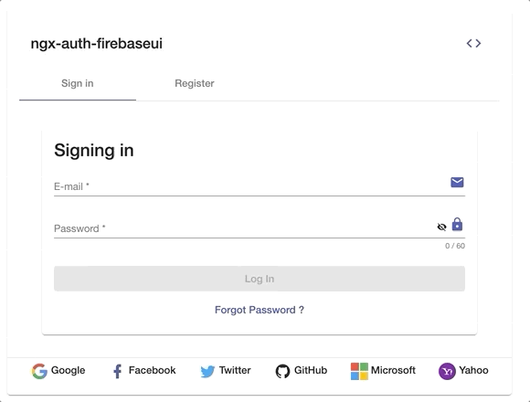

<p align="center">
  
</p>

# ngx-auth-firebaseui - Open Source Library for Angular Web Apps to integrate a material user interface for firebase authentication.

[](https://badge.fury.io/js/ngx-auth-firebaseui)
[](https://ngx-auth-firebaseui.firebaseapp.com)
[](https://ngx-auth-firebaseui.firebaseapp.com/doc/index.html)
[](https://codecov.io/gh/anthonynahas/ngx-auth-firebaseui)
[](https://circleci.com/gh/AnthonyNahas/ngx-auth-firebaseui)
[](https://travis-ci.org/AnthonyNahas/ngx-auth-firebaseui)
[](https://gitter.im/ngx-auth-firebaseui/Lobby?utm_source=badge&utm_medium=badge&utm_campaign=pr-badge&utm_content=badge)
[](https://david-dm.org/anthonynahas/ngx-auth-firebaseui)
[](https://david-dm.org/anthonynahas/ngx-auth-firebaseui#info=devDependencies)
[](https://www.npmjs.com/package/ngx-auth-firebaseui)
[](https://greenkeeper.io/)
[](https://github.com/AnthonyNahas/ngx-auth-firebaseui/blob/master/LICENSE)
[](https://github.com/AnthonyNahas/ngx-auth-firebaseui/fork)
[](https://github.com/AnthonyNahas/ngx-auth-firebaseui)
[](https://github.com/AnthonyNahas/ngx-auth-firebaseui)
[](https://twitter.com/ngAnthonyy)
[](https://twitter.com/ngAnthonyy)
[](https://github.com/gdi2290/awesome-angular)

<p align="center">
  
</p>

Angular UI component for [firebase](https://firebase.google.com/docs/auth/web/firebaseui) authentication.
This library is an angular module (including angular components and services) that allows to authenticate
your users with your firebase project. NgxAuthFirebseUI is compatible with
[angular material](https://material.angular.io/) and [angular flexLayout](https://github.com/angular/flex-layout).


If you prefer to develop with bootstrap rather than with material design, please check this project [@firebaseui/ng-bootstrap](https://github.com/firebaseui/ng-bootstrap)


## Built by and for developers :heart:
Do you have `any` question or suggestion ? Please do not hesitate to contact us!
Alternatively, provide a PR | open an appropriate issue [here](https://github.com/anthonynahas/ngx-auth-firebaseui/issues)

If you like this project, support [ngx-auth-firebaseui](https://github.com/anthonynahas/ngx-auth-firebaseui) 
by starring :star: and sharing it :loudspeaker:

## Table of Contents
- [overview](#overview)
- [examples](#examples)
- [Usage](#usage)
- [API](#api)
- [Other Angular Libraries](#other-angular-libraries)
- [Support](#support)
- [License](#license)

<a name="overview"/>

## Overview `ngx-auth-firebaseui` used for (authentication) login and registration to any firebase project incl. auth providers like google, facebook, twitter github, microsoft and yahoo


#### Login

<p align="center">
  
</p>

#### animation

<p align="center">
  
</p>

#### Register

<p align="center">
  
</p>

#### i18n

<p align="center">
  
</p>


#### email verification

<p align="center">
  
</p>

#### Screenshots - Client Side Validation <ngx-auth-firebaseui></ngx-auth-firebaseui>

<p align="center">
  
</p>


<a name="examples"/>

## Examples

- [demo - overview - everything you need](https://ngx-auth-firebaseui.firebaseapp.com)
- [i18n](https://ngx-auth-firebaseui.firebaseapp.com/i18n)
- [appearance - how should the inputs looks like](https://ngx-auth-firebaseui.firebaseapp.com/examples/appearance)
- [choose your authentication providers](https://ngx-auth-firebaseui.firebaseapp.com/examples/providers)
- [start with the login or register tab ?](https://ngx-auth-firebaseui.firebaseapp.com/examples/tabIndex)
- [enable/disable the registration tab](https://ngx-auth-firebaseui.firebaseapp.com/examples/registration)
- [is you user allowed to reset his/her password? You can disable the appropriate button](https://ngx-auth-firebaseui.firebaseapp.com/examples/reset-password)
- [Disable the anonymous registration on demand via the guest input](https://ngx-auth-firebaseui.firebaseapp.com/examples/guest)
- [if you are providing a terms of services url, the user should check the checkbox to continue the registration process](https://ngx-auth-firebaseui.firebaseapp.com/examples/tos)
- [customize you auth messages - for the onSuccess and onError events](https://ngx-auth-firebaseui.firebaseapp.com/examples/messages)
- [specify the url to use after authentication](https://ngx-auth-firebaseui.firebaseapp.com/examples/gobackurl)
- [password strengh api - customize the pass strength on your own](https://ngx-auth-firebaseui.firebaseapp.com/examples/password-strength)
- [guards api of the library can be used to protect any angular routes from unanthenticated users](https://ngx-auth-firebaseui.firebaseapp.com/examples/logged-in)

<a name="usage"/>

## Usage

```html
<!-- You can now use the library component in app.component.html  -->

<ngx-auth-firebaseui (onSuccess)="printUser($event)"
                     (onError)="printError()">
</ngx-auth-firebaseui>
```
or
```typescript
<!-- or simply in the app.component.ts -->
@Component({
    selector: 'app',
    template: `
        <ngx-auth-firebaseui (onSuccess)="printUser($event)" (onError)="printError()"></ngx-auth-firebaseui>`
})
class AppComponent {

    printUser(event) {
        console.log(event);
    }

    printError(event) {
        console.error(event);
    }
}
```

<a name="api"/>

## API

| option | bind  |  type  |   default    | description  |
|:---------------------|:------:|:------:|:------------:|:-------------------------------------------------------------------------------------------------|
| providers            | `Input()`  | `string[]` | ['all'] or [AuthProvider.All] | choose your favorite authentication provider: google | facebook | twitter | github
| appearance           | `Input()`  | `MatFormFieldAppearance` | `standard` | the appearance of the mat-form-field #'legacy' | 'standard' | 'fill' | 'outline' 
| tabIndex             | `Input()`  | `number`  | `null`; | `0` | the selected tab - either sign in or register
| registrationEnabled  | `Input()`  | `boolean` | `true` | whether the user is able to register a new account
| resetPasswordEnabled | `Input()`  | `boolean` | `true` | whether the user is able to reset his account password
| guestEnabled         | `Input()`  | `boolean` | `true` | whether the user can sign in and continue as guest
| tosUrl               | `Input()`  | `string`  | - | the url of term of services
| privacyPolicyUrl     | `Input()`  | `string`  | - | the url of the private privacy
| goBackURL            | `Input()`  | `string`  | - | the url to redirect to after creating a new user and clicking the `go back` button - the button is only available when the input is provided 
| messageOnAuthSuccess | `Input()`  | `string`  | see the code -> | the message of the snackbar when the authentication process was successful
| messageOnAuthError   | `Input()`  | `string`  | see the code -> | the message of the snackbar when the authentication process has failed
| onSuccess            | `Output()` | `any`     | - | this will be fired when an authentication process was success. The authenticated user is emitted!
| onError              | `Output()` | `any`     | - | this event will be fired when an error occurred during the authentication process! An error message is emitted!

if you prefer to customize the text of this component, check these inputs [here](https://ngx-auth-firebaseui.firebaseapp.com/i18n) that have been used for translations

PS: if either `tosUrl` or `privacyPolicyUrl` are provided, the user will be asked to check and accepts tos and pp before registering a new account or sign in in anonymously

### Password strength API 

| option | bind  |  type  |   default    | description  |
|:---------------------|:------:|:------:|:------------:|:-------------------------------------------------------------------------------------------------|
| selectedTabChange    | `Output()` | `MatTabChangeEvent` | - |  output event is emitted when the active tab changes (signin, register and reset password tab)
| enableLengthRule     | `Input()`  | `boolean`  | `true` | whether to validate the length of the password
| enableLowerCaseLetterRule      | `Input()`  | `boolean`  | `true` | whether a lowercase letter is optional
| enableUpperCaseLetterRule      | `Input()`  | `boolean`  | `true` | whether a uppercase letter is optional
| enableDigitRule      | `Input()`  | `boolean`  | `true` | whether a digit char is optional
| enableSpecialCharRule      | `Input()`  | `boolean`  | true | whether a special char is optional
| min      | `Input()`  | ``number``   | 8 | the minimum length of the password
| max      | `Input()`  | ``number``   | 60 | the maximum length of the password
| onStrengthChanged  | `Output()` | ``number``    | - | emits the strength of the provided password in % e.g: 20%, 40%, 60%, 80% or 100% [learn more](https://github.com/angular-material-extensions/password-strength)


### Email Confirmation Component

| option | bind  |  type  |   default    | description  |
|:---------------------|:------:|:------:|:------------:|:-------------------------------------------------------------------------------------------------|
|  verifyEmailTemplate      | `Input()`  | `TemplateRef<any>` | `-` | custom template for the email confirmation component 
|  verifyEmailTitleText      | `Input()`  | `string` | `Confirm your e-mail address!` | - 
|  verifyEmailConfirmationText      | `Input()`  | `string` | `A confirmation e-mail has been sent. Check your inbox and click on the link "Confirm my e-mail" to confirm your e-mail address.` | - 
|  verifyEmailGoBackText      | `Input()`  | `string` | `Go back` | - 
|  sendNewVerificationEmailText      | `Input()`  | `string` | `Send new confirmation e-mail` | - 
|  signOutText      | `Input()`  | `string` | `Sign out` | - 


### i18n

| option | bind  |  type  |   default    | description  |
|:---------------------|:------:|:------:|:------------:|:-------------------------------------------------------------------------------------------------|
| resetPasswordTabText            | `Input()`  | `string` | `Reset e-mail address to password` | see context 
| resetPasswordInputText            | `Input()`  | `string` | `Reset e-mail address to password` | see context 
| resetPasswordErrorRequiredText            | `Input()`  | `string` | `E-mail is required to reset the password!` | see context 
| resetPasswordErrorPatternText            | `Input()`  | `string` | `Please enter a valid e-mail address` | see context 
| resetPasswordActionButtonText          | `Input()`  | `string` | `Reset` | see context 
| resetPasswordInstructionsText       | `Input()`  | `string` | `Reset requested. Check your e-mail instructions.` | see context 
| signInTabText      | `Input()`  | `string` | `Sign in` | see context 
| signInCardTitleText    | `Input()`  | `string` | `Signing in` | see context 
| loginButtonText       | `Input()`  | `string` | `Log In` | see context 
| forgotPasswordButtonText      | `Input()`  | `string` | `Forgot Password ?` | see context 
| nameText       | `Input()`  | `string` | `Name` | see context 
| nameErrorRequiredText       | `Input()`  | `string` | `Name is required` | see context 
| nameErrorMinLengthText      | `Input()`  | `string` | `The name is too short!` | see context 
| nameErrorMaxLengthText       | `Input()`  | `string` | `The name is too long!` | see context 
| emailText       | `Input()`  | `string` | `E-mail` | see context 
| emailErrorRequiredText       | `Input()`  | `string` | `E-mail is required` | see context 
| emailErrorPatternText       | `Input()`  | `string` | `Please enter a valid e-mail address` | see context 
| passwordText       | `Input()`  | `string` | `Password` | see context 
| passwordErrorRequiredText       | `Input()`  | `string` | `Password is required` | see context 
| passwordErrorMinLengthText       | `Input()`  | `string` | `The password is too short!` | see context 
| passwordErrorMaxLengthText       | `Input()`  | `string` | `The password is too long!` | see context 
| registerTabText       | `Input()`  | `string` | `Register` | see context 
| registerCardTitleText       | `Input()`  | `string` | `Registration` | see context 
| registerButtonText       | `Input()`  | `string` | `Register` | see context 
| guestButtonText      | `Input()`  | `string` | `continue as guest` | see context 
| emailConfirmationTitle       | `Input()`  | `string` | `Confirm your e-mail address!` | see context 
| emailConfirmationText      | `Input()`  | `string` | `A confirmation e-mail has been sent to you. Check your inbox and click on the link "Confirm my e-mail" to confirm your e-mail address.` | see context 


### How to disable users to sign in and continue as guest, use the `guestEnabled` input

```html
<ngx-auth-firebaseui [guestEnabled]="false"
                     (onSuccess)="printUser($event)"
                     (onError)="printError($event)">
</ngx-auth-firebaseui>
```

Result:

<p align="center">
  
</p>

### How to configure your input providers ? [see the examples](https://ngx-auth-firebaseui.firebaseapp.com/examples)
e.g:
in your component, import the AuthProvider enum to pick up your favorite provider:

```typescript
import {OnInit} from '@angular/core';
import {AuthProvider} from 'ngx-auth-firebaseui';

export class ExampleComponent implements OnInit {

  providers = AuthProvider;

  ngOnInit() {
  }
}
```

in your template -->
```html
  <ngx-auth-firebaseui
  [providers]="[providers.Google, providers.Facebook, providers.Twitter]"
  (onSuccess)="printUser($event)"
   (onError)="printError()"></ngx-auth-firebaseui>
```

or

```html
  <ngx-auth-firebaseui
  [providers]="['google', 'facebook', 'twitter']"
  (onSuccess)="printUser($event)"
  (onError)="printError()">
</ngx-auth-firebaseui>
```

take a look at the full documentation [here](https://ngx-auth-firebaseui.firebaseapp.com/doc/index.html)


<a name="other-angular-libraries"/>

## Other Angular Libraries
- [@firebaseui/ng-bootstrap](https://github.com/firebaseui/ng-bootstrap)
- [ngx-linkifyjs](https://github.com/anthonynahas/ngx-linkifyjs)
- [@angular-material-extensions/components](https://github.com/angular-material-extensions/components)
- [@angular-material-extensions/password-strength](https://github.com/angular-material-extensions/password-strength)
- [@angular-material-extensions/google-maps-autocomplete](https://github.com/angular-material-extensions/google-maps-autocomplete)
- [@angular-material-extensions/pages](https://github.com/angular-material-extensions/pages)
- [@angular-material-extensions/link-preview](https://github.com/angular-material-extensions/link-preview)
- [@angular-material-extensions/contacts](https://github.com/angular-material-extensions/contacts)
- [@angular-material-extensions/faq](https://github.com/angular-material-extensions/faq)
- [@angular-material-extensions/jumbotron](https://github.com/angular-material-extensions/jumbotron)
- [angular-material-extensions/freelancer-theme](https://github.com/angular-material-extensions/freelancer-theme)
- [@angular-material-extensions/combination-generator](https://github.com/angular-material-extensions/combination-generator)

---

<a name="support"/>

## Support
+ Drop an email to: [Anthony Nahas](mailto:anthony.na@hotmail.de)
+ or open an appropriate [issue](https://github.com/anthonynahas/ngx-auth-firebaseui/issues)
+ let us chat on [Gitter](https://gitter.im/ngx-auth-firebaseui/Lobby)
 
 Built by and for developers :heart: we will help you :punch:

---


This project is supported by [jetbrains](https://www.jetbrains.com/) with 1 ALL PRODUCTS PACK OS LICENSE incl. [webstorm](https://www.jetbrains.com/webstorm)

---

<a name="license"/>

## License

Copyright (c) 2019 [Anthony Nahas](https://github.com/AnthonyNahas). Licensed under the MIT License (MIT)
